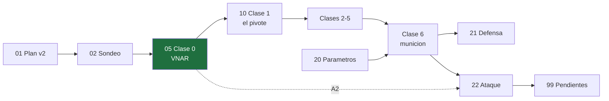

# 🦈 Seminario — VNAR humanization (Liedl 2022)

> [!info] El paper
> Fernández-Quintero ML, Fischer A-LM, Kokot J, Waibl F, Seidler CA, **Liedl KR**.
> **The influence of antibody humanization on shark variable domain (VNAR) binding site ensembles.**
> *Front. Immunol.* **13**:953917 (2022) · DOI [10.3389/fimmu.2022.953917](https://doi.org/10.3389/fimmu.2022.953917)
> **20 citas** (OpenAlex, consultado 2026-08-26) · PDF local: `../fimmu-13-953917.pdf`

**Encargo:** presentar en lab meeting con **énfasis metodológico** (metadinámica + MD clásica).
**Objetivo real:** poder (a) defender por qué el pipeline tiene sentido y (b) señalar dónde es vulnerable.

---

## Cómo está organizado esto

### Proceso

| Nota | Qué es | Estado |
|---|---|---|
| [[01 Plan de aprendizaje]] | Plan `v2` + mapa de dependencias | ✅ **aprobado** |
| [[02 Sondeo — mapa de mi borde]] | Dónde está mi borde en cada hebra | ✅ cerrado — 7 preguntas |

### Clases — contenido → quiz → contenido → quiz

| Clase | Nodos | Estado |
|---|---|---|
| [[05 Clase 0 — El VNAR]] | `R4` | ✅ **cerrada — 4/4** |
| [[10 Clase 1 — El problema y el pivote]] | `R1` `R2` `N1` + **M3 demolida** | ✅ **cerrada — 4/4** |
| [[11 Clase 2 — Inventar la metadinámica]] | **M1 demolida**, `N3` `N4` | ✅ **cerrada — 4/5** |
| *Clase 3 — El precio: CVs y cinética* | `N5` `N6` `N7` | ⚪ |
| *Clase 4 — tICA* | `N8` `N9` | ⚪ |
| *Clase 5 — El MSM* | demoler **M2**, `N10` `N11` `N12` | ⚪ |
| *Clase 6 — Munición* | META a, b | ⚪ |

### Presentación

| Nota | Qué es | Estado |
|---|---|---|
| [[40 Presentación — plan]] | Plan de la charla «Inventando la metadinámica» — **cobertura completa del paper** | ✅ `v3` |
| `presentacion/slides.tex` | Beamer, **47 slides**, tema sobrio, pies de figura del paper | ✅ compila |
| `presentacion/handout.tex` | Article, derivaciones completas, **12 pág.** | ✅ compila |

### Referencia

| Nota | Qué es | Estado |
|---|---|---|
| [[20 Paper — parámetros exactos]] | Parámetros del pipeline, verbatim | ✅ |
| [[99 Pendientes de verificación]] | Qué falta comprobar antes de la charla | 🟠 **8 abiertos** |
| *21 Defensa del pipeline* | Munición para (a) | ⚪ por escribir |
| *22 Superficie de ataque* | Munición para (b) — 11 críticas | ⚪ por escribir |
| [[30 Glosario de símbolos]] | Toda la notación: qué es cada símbolo y de qué **tipo** | ✅ |
| `assets/` | **Figuras del paper** extraídas del PDF y embebidas en las clases | ✅ 7 imágenes |
| *24 Referencias verificadas* | Refs confirmadas vs OpenAlex / Europe PMC | ⚪ por escribir |

> [!note] Sobre las notas 21, 22 y 24
> El material está investigado y verificado pero **aún sin escribir** — se escribirán al llegar a la Clase 6, para que salgan **derivadas del mapa** y no como una lista que memorizar.
> La antigua *23 Fondo — qué es un VNAR* quedó absorbida por [[05 Clase 0 — El VNAR]].

---

## El paper en un párrafo

Un VNAR de mielga (*Squalus acanthias*), **parent E06**, une albúmina humana (HSA) con alta afinidad. Lo humanizan progresivamente (**huE06 v1.1 → v1.2 → v1.4**), y una variante extra (**v1.10**) **revierte** el motivo `RKN`. Comparan contra la línea germinal humana **DPK9** (Vκ1). Hallazgo: humanizar no solo baja la afinidad, **desplaza las poblaciones del ensemble** — el estado que coincide con el cristal del complejo cae de **92 %** (E06) a **16 %** (v1.1 y v1.4), y v1.10 lo recupera. Marco conceptual: **selección conformacional** — el antígeno elige un confórmero ya poblado, así que perder afinidad = despoblar el estado competente.

## La tensión metodológica central

> [!abstract] Todo el seminario cuelga de esta frase
> Metadinámica **destruye la cinética** para ganar ergodicidad. El MSM la **reconstruye**.
> **¿Por qué eso es legítimo?**

Cada crítica de [[22 Superficie de ataque]] es una forma de preguntar si se cumplen las condiciones que hacen legítimo ese intercambio. Por eso el plan construye la tensión primero.

## Las tres de mayor impacto

Si solo te queda tiempo para tres cosas en la charla:

1. 🔴 [[22 Superficie de ataque#🔴 A1 — El muestreo está confundido con el observable|A1]] — el corte de clustering fijo hace que el sistema "rígido" reciba **3.6× menos muestreo** que el "flexible", y los observables reportados crecen con el muestreo.
2. 🔴 [[22 Superficie de ataque#🔴 A2 — HV2 entra en el MSM pero nunca se sesgó en la metadinámica|A2]] — **HV2 nunca se sesgó**, pero está en el MSM y sostiene la conclusión biológica.
3. 🔴 [[22 Superficie de ataque#🔴 A3 — Ni una barra de error|A3]] — **92 % vs 16 %** sin un solo intervalo de confianza, teniendo `BayesianMSM` gratis en PyEMMA.

Y la carta de defensa más fuerte: [[21 Defensa del pipeline#Esto no es un protocolo ad hoc|Biswas, Lickert & Stock 2018]] dice explícitamente que la metadinámica se usa *solo* para generar conformaciones iniciales — así que "vuestra metadinámica no converge" **no es una objeción válida**.

---

## Infraestructura de la sesión

El subagente `researcher` está caído (`400 out of extra usage`, la cuota que anticipa `../SETUP.md`). Las verificaciones de estas notas se hicieron con `web_search` / `web_fetch` **directamente desde la sesión principal**, que sí los tiene cargados. Backends usados: OpenAlex (citas + DOI), Europe PMC (abstracts), fetch de PMC en HTML.

Para volcar la transcripción de la sesión a Obsidian: `/md-log Presentación seminario.md` (rellena hacia atrás).
