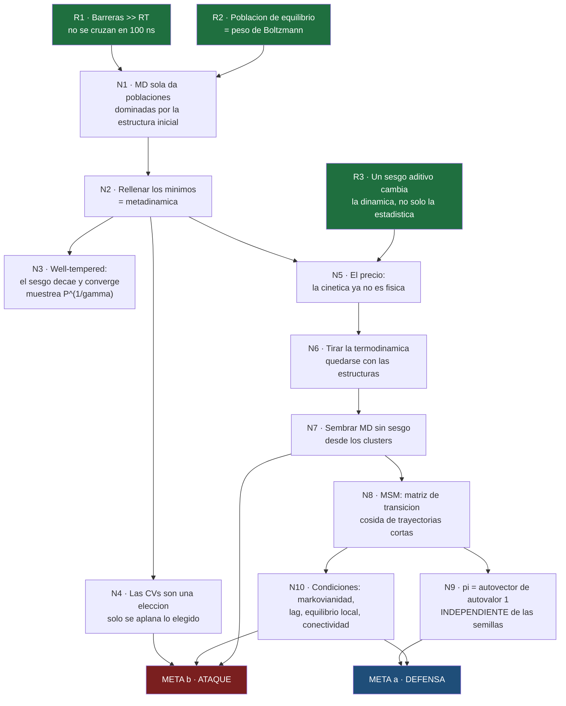
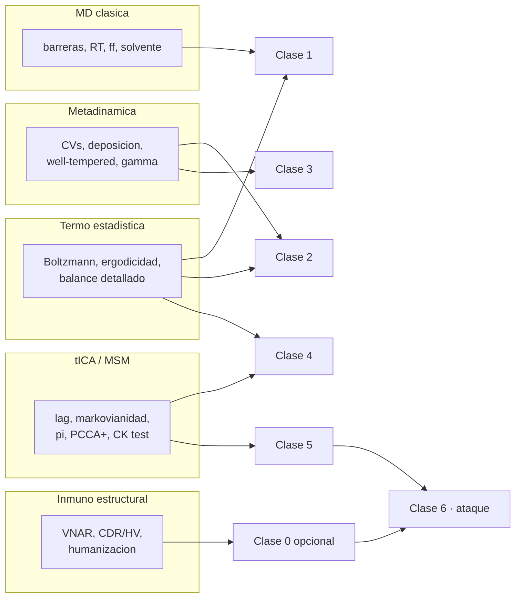

# 01 · Plan de aprendizaje

← [[00 MOC — Seminario VNAR]]

> [!warning] Esperando tu visto bueno
> Este plan es el **checkpoint**. Una raíz mal puesta o un alcance equivocado es barato de arreglar ahora y caro a mitad de clase. **No empiezo las clases 2+ hasta que lo apruebes.**
> Además el [[02 Sondeo — mapa de mi borde|sondeo]] está pendiente, así que los niveles de abajo son **conjetura**, no dato.

---

## 1. El enfoque, en prosa

El nudo de este paper no es ninguna técnica individual. Es **una sola tensión**:

> Metadinámica destruye la cinética para ganar ergodicidad. El MSM la reconstruye. ¿Por qué eso es legítimo?

Si esa frase se entiende de verdad — no se memoriza, se *entiende* — la defensa y el ataque se derivan casi solos, porque **cada crítica al paper es una forma de preguntar si se cumplen las condiciones que hacen legítimo ese intercambio**. Ahí está la compresión que busco: no diez críticas suel­tas que memorizar, sino un principio del que las diez salen.

Por eso **no** voy a recorrer el pipeline en su orden de ejecución (metaD → cluster → MD → MSM). Ese orden es cronológico, no lógico: te obliga a aceptar la metadinámica antes de saber qué problema resuelve, y a aceptar el MSM antes de saber qué daño hay que reparar. Es exactamente la receta para que todo se sienta arbitrario.

El orden que propongo es el de **descubrimiento**:

1. Establecer el problema desde verdades que aceptes sin matices → **¿por qué la MD sola no puede responder la pregunta del paper?**
2. Dejar que la metadinámica aparezca como la solución que tú mismo habrías propuesto → rellenar los mínimos.
3. Mostrar el **precio** que se paga (la cinética) — no como una nota al pie, sino como el punto de giro de toda la historia.
4. Solo entonces el MSM entra, y entra como **reparación obligada**, no como una técnica más del catálogo.
5. Los ataques al final, cada uno **anclado a la condición concreta que viola**.

La ventaja de este orden para tu lab meeting: es también el mejor guion para la charla. Si presentas el pipeline como cronología, la audiencia oye cuatro herramientas. Si lo presentas como problema → solución → precio → reparación, oyen **un argumento**, y las críticas caen en su sitio.

---

## 2. Mapa de dependencias

Este mapa **es** el orden de enseñanza. Las clases construyen sus nodos uno a uno.

**Verde = raíces** (verdades incondicionales, se aceptan al pie de la letra) · **Azul/rojo = los dos objetivos**.

> [!question] Lo primero que necesito que audites
> Los tres nodos verdes. ¿Cada uno te resulta **obvio y sin matices**? Si alguno necesita un "bueno, depende…", está mal puesto como raíz y hay que bajar más. Es la pregunta más importante de esta nota: una raíz podrida corrompe todo lo que se cuelgue de ella.

---

## 3. De qué nodo sale cada crítica

Esta es la tabla que convierte el mapa en munición. Cada ataque de [[22 Superficie de ataque]] no es un dato aislado: es un nodo del grafo cuya condición no se verificó.

| Nodo violado | Ataque que genera | Severidad |
|---|---|---|
| **N4** las CVs son una elección | **A2** — HV2 está en el MSM pero nunca se sesgó | 🔴 |
| **N7** sembrar desde los clusters | **A1** — el muestreo está confundido con el observable | 🔴 |
| **N9** π independiente de las semillas | **A6** — ¿la Fig. 3A es histograma crudo o está reponderada? | 🟠 |
| **N10** condiciones del MSM | **A3** sin barras de error · **A4** lag 15 ns vs trayectorias de 100 ns | 🔴 / 🟠 |
| **R2/R3** el modelo físico de base | **A5** AF2 · **A7** TIP3P · **A8** carga de fondo | 🟠 / 🟡 |
| *(externo al grafo)* | **A9** higiene de citas · **A10** alternativas no discutidas | 🟡 |

> [!tip] Por qué esto importa para la charla
> Presentar las críticas así — *"esta condición del método no se verificó"* — es infinitamente más fuerte que *"me parece que faltó un control"*. Lo primero es metodología; lo segundo es opinión.

---

## 4. Las cinco hebras y dónde cae cada clase

| Clase | Nodos | Hebras | Modo | Estado |
|---|---|---|---|---|
| **0** · VNAR en 10 min *(opcional)* | — | Inmuno | Expositivo | ⚪ solo si te hace falta |
| **1** · [[10 Clase 1 — Por qué la MD sola no basta\|Por qué la MD sola no basta]] | R1, R2, N1 | MD + Termo | **Socrático** | 🟢 borrador listo |
| **2** · Inventar la metadinámica | N2, N3 | Metad + Termo | Socrático → expositivo | ⚪ |
| **3** · El precio: CVs y cinética | R3, N4, N5 | Metad | Expositivo | ⚪ |
| **4** · El MSM como reparación | N6, N7, N8, N9 | MSM + Termo | Expositivo | ⚪ |
| **5** · Las condiciones (dónde se rompe) | N10 | MSM | Socrático | ⚪ |
| **6** · Munición: defensa y ataque | META a, b | todas | Socrático | ⚪ |

**Socrático** = te planteo el problema y lo intentas antes de que yo revele. **Expositivo** = lo narro yo. La clase 3 va expositiva porque "el sesgo rompe la cinética" no es algo que se deduzca en frío; la 5 va socrática porque para entonces ya tendrás todas las piezas.

---

## 5. Decisiones que necesito de ti

> [!question] 1. ¿Apruebas el orden lógico en vez del cronológico?
> Tensión primero (problema → solución → precio → reparación), no metaD → cluster → MD → MSM.

> [!question] 2. ¿Retomamos el sondeo?
> Cancelaste el primer quiz. Sin sondeo estoy adivinando tu borde y probablemente enseñaré cosas que ya sabes o daré por sentado lo que no. Serían **2–3 preguntas por hebra**, adaptándose a tus respuestas. Ver [[02 Sondeo — mapa de mi borde]] para lo que tengo preparado.
> Alternativa: te describes tú mismo en prosa y me salto los quizzes de diagnóstico.

> [!question] 3. ¿Cuánto peso al ataque?
> Si el lab meeting es hostil o te van a apretar, invierto más en la clase 6 y en [[22 Superficie de ataque]]. Si es más divulgativo, cargo la 2–4.

> [!question] 4. ¿Necesitas la Clase 0 de inmunología?
> ¿Ya sabes qué es un CDR, un paratopo y qué significa humanizar? Si sí, me la salto y ganamos tiempo.
