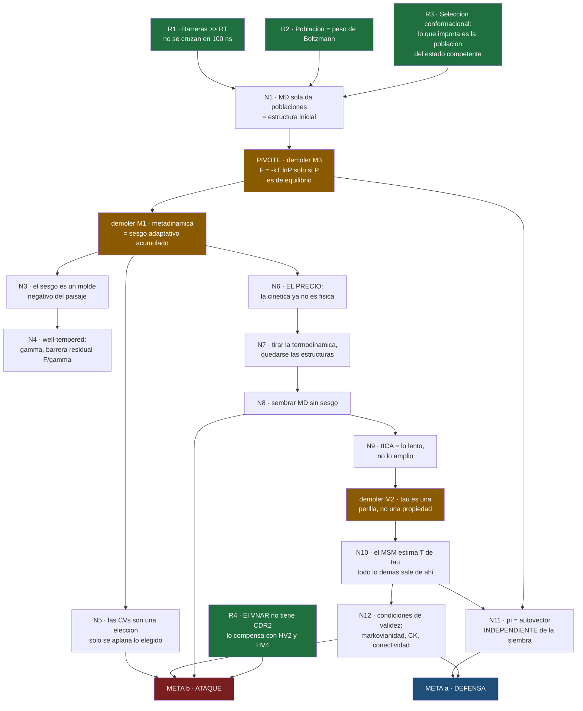

# 01 · Plan de aprendizaje `v2`

← [[00 MOC — Seminario VNAR]] · datos: [[02 Sondeo — mapa de mi borde]]

> [!warning] Esperando tu visto bueno
> Este es el checkpoint. Una raíz mal puesta o un alcance equivocado es barato de arreglar ahora y caro a mitad de clase.
> **v2** — reescrito con los datos reales del sondeo. La v1 era conjetura y se equivocaba en dos cosas importantes: daba por supuesto que tenías metadinámica «a nivel de sé qué hace» (está en cero) y planeaba una clase de inmunología (no hace falta).

---

## 1. Lo que cambió tras el sondeo

| | Plan v1 (conjetura) | Sondeo (dato) | Consecuencia en v2 |
|---|---|---|---|
| MD clásica | «probablemente sólida» | ✅ **sólida** | Se **comprime**: no se enseña, se usa como cimiento |
| Inmunología | «nueva, hace falta Clase 0» | ✅ tiene el **marco**; la **anatomía del VNAR** no se sondéó | Clase 0 **se mantiene**, reenfocada → ver §2bis |
| Metadinámica | «sabe qué hace» | ❌ **cero + misconcepción** | Se **duplica** y empieza por demoler M1 |
| tICA / MSM | «más flojo» | ❌ **cero** | Se **triplica**; tICA gana clase propia |
| Termo estadística | «funcional» | ⚠️ **misconcepción en la capa de inferencia** | Pasa a ser **el eje del curso** |

---

## 2. El enfoque, en prosa

El sondeo encontró **una sola línea de fractura**: tienes firme la *física de producir una trayectoria* y firme la *pregunta biológica*, y vacío todo el centro — la *estadística de inferir algo a partir de trayectorias*. Los dos extremos sujetos, el puente ausente.

Eso es una suerte enorme, porque **ese puente es exactamente la metodología de este paper**. No hay que enseñarte MD ni inmunología: hay que tender una sola cosa, y va a quedar anclada en roca por ambos lados.

Así que el eje del curso no es «explicar cuatro técnicas». Es **una única pregunta, repetida en cada etapa del pipeline**:

> ### ¿Qué me autoriza a leer este número como una cantidad física?

Metadinámica, clustering, MD sembrada y MSM son cuatro respuestas sucesivas a esa pregunta. Y las diez críticas de [[22 Superficie de ataque]] son diez sitios donde la respuesta no se dio.

Ahí está la compresión que busco: **no diez críticas que memorizar, sino un principio del que las diez salen.** Si te preguntan algo en el lab meeting que no preparamos, esa pregunta sigue funcionando.

### Por qué no voy en orden cronológico

El orden de ejecución (metaD → cluster → MD → MSM) es cronológico, no lógico. Te obliga a aceptar la metadinámica antes de saber qué problema resuelve, y el MSM antes de saber qué daño hay que reparar. Es la receta para que todo se sienta arbitrario — y para no poder criticarlo, porque una técnica que no sabes por qué está ahí tampoco sabes cuándo falla.

El orden que propongo es el de **descubrimiento**: problema → solución → **precio** → reparación. Bonus: ese es también el mejor guion para tu charla. Presentado como cronología, la audiencia oye cuatro herramientas; presentado así, oye **un argumento**.

### Las tres demoliciones

Un hueco se rellena. Una creencia equivocada hay que **quitarla primero**, o lo nuevo se apila encima y no agarra. El sondeo destapó tres, y cada una tiene su momento asignado:

| # | Creencia | Se demuele en |
|---|---|---|
| **M3** | «$-k_BT\ln P$ es la energía libre» | **Clase 1** — es el pivote de todo |
| **M1** | «metadinámica = subir la temperatura» | **Clase 2** — antes de cualquier parámetro |
| **M2** | «$\tau$ es el tiempo de residencia» | **Clase 5** — antes de validar nada |

---

## 3. Mapa de dependencias `v2`

Este mapa **es** el orden de enseñanza.

🟩 **raíces** — verdades incondicionales, ya las tienes · 🟧 **demoliciones** · 🟦🟥 **los dos objetivos**

> [!success] Estado de las raíces tras el sondeo
> **R1 y R2** quedaron cubiertas por tu acierto en ensembles/barostatos; **R3**, por tu acierto en selección conformacional. El curso arranca sobre terreno probado.
> Quedan dos sin verificar, y ambas se cierran rápido al empezar:
> - **R4** (anatomía del VNAR) — nunca se sondeó → **Clase 0**
> - $RT \approx 2.5$ kJ/mol de cabeza — 30 segundos al abrir la Clase 1

> [!info] El nodo pivote — dónde gira todo
> **N11: $\pi$ es independiente de dónde sembraste.** Ese es el nodo que hace legítimo el pipeline entero: es la respuesta formal a la objeción «pero sembraste con un sesgo». Fíjate en el mapa que **M3 apunta directamente a N11** — la misconcepción que tienes ahora es *exactamente* lo que hace invisible el nodo que salva al paper. Por eso M3 se demuele primero.

---

## 4. De qué nodo sale cada crítica

Esta tabla convierte el mapa en munición. Cada ataque **no es un dato suelto: es un nodo cuya condición no se verificó.**

| Nodo | Ataque que genera | Severidad |
|---|---|---|
| **N5** las CVs son una elección | **A2** — HV2 está en el MSM pero nunca se sesgó | 🔴 |
| **N8** sembrar desde clusters | **A1** — el muestreo está confundido con el observable | 🔴 |
| **N11** $\pi$ independiente de la siembra | **A6** — ¿la Fig. 3A está reponderada o es histograma crudo? | 🟠 |
| **N12** condiciones del MSM | **A3** sin barras de error · **A4** lag 15 ns vs trayectorias 100 ns | 🔴 / 🟠 |
| *modelo físico de base* | **A5** AF2 · **A7** TIP3P · **A8** carga de fondo · **A11** todo vive en 10 kJ/mol | 🟠 / 🟡 |
| *externo* | **A9** higiene de citas · **A10** alternativas no discutidas | 🟡 |

> [!tip] Cómo formular una crítica para que no suene a opinión
> *«Esta condición del método no se verificó»* ≫ *«creo que faltó un control»*.
> Lo primero es metodología y no se puede esquivar. Lo segundo es una opinión y se contesta con otra.

---

## 5. Las clases

| # | Clase | Nodos | Modo | Peso |
|---|---|---|---|---|
| **0** | **El VNAR** — qué le falta, con qué lo compensa, y qué significa humanizar | R3, **R4** | Expositivo | ●○○ |
| **1** | **El problema y el pivote** — por qué la MD sola no basta, y por qué un histograma no es una energía libre | R1, R2, N1, **demoler M3** | Socrático | ●●○ |
| **2** | **Inventar la metadinámica** — sesgo adaptativo, molde negativo, well-tempered, $\gamma$ | **demoler M1**, N3, N4 | Socrático | ●●● |
| **3** | **El precio** — las CVs son una elección, y la cinética muere | N5, N6, N7 | Expositivo | ●●○ |
| **4** | **tICA** — encontrar lo lento, no lo amplio | N8, N9 | Expositivo | ●○○ |
| **5** | **El MSM** — $T(\tau)$, y todo lo que sale de ahí | **demoler M2**, N10, N11, N12 | Expositivo → Socrático | ●●● |
| **6** | **Munición** — defensa y ataque, derivados del mapa | META a, b | Socrático | ●●● |

Cada clase es un `.md` con **contenido → quiz → contenido → quiz**, hasta cerrar sus nodos.
Modo **socrático** = te planteo el problema y lo intentas antes de que yo revele. **Expositivo** = lo narro yo. Las clases 3 y 4 van expositivas porque no son deducibles en frío; la 5 gira a socrático en cuanto tengas $T(\tau)$.

> [!important] §2bis · Por qué la Clase 0 de inmunología se queda
> El sondeo confirmó que tienes el **marco conceptual** — selección conformacional, y por qué eso convierte *la población del estado competente* en la medida de interés. Eso es el techo del curso y está firme.
>
> Pero **nunca sondéé la anatomía del VNAR**, y ahí hay un nodo que **no es opcional**, porque de él depende el ataque más fuerte de todo el paper:
>
> > Un VNAR **carece de CDR2** — perdió las hebras β C′ y C′′ — y lo **compensa con HV2 y HV4**. HV2 forma un cinturón alrededor del dominio.
>
> Sin ese nodo, [[22 Superficie de ataque#🔴 A2 — HV2 entra en el MSM pero nunca se sesgó en la metadinámica|A2]] es una observación técnica menor: *«bueno, no sesgaron un loop»*. **Con** ese nodo, A2 se vuelve demoledor: no sesgaron el loop que **sustituye a la CDR2**, en un dominio que **solo tiene dos CDR**, y encima es el loop al que ellos mismos atribuyen la pérdida de afinidad.
>
> Es decir: la inmunología aquí no es contexto decorativo. Es **munición metodológica**. Por eso la Clase 0 se queda — pero corta y apuntada a eso, no a «qué es un anticuerpo».
> Material ya escrito y verificado: [[23 Fondo — qué es un VNAR]].

> [!note] La Clase 1 ya existe en borrador
> [[10 Clase 1 — Por qué la MD sola no basta]] está escrita, pero **con el enfoque v1**: dedica mucho espacio a R1/R2, que ya tienes. Si apruebas este plan la reescribo comprimiendo esa parte y poniendo el peso en la demolición de M3, que es lo que el sondeo dice que hace falta.

---

## 6. Lo que necesito de ti para arrancar

> [!question] 1 · ¿Apruebas el eje?
> «¿Qué me autoriza a leer este número como cantidad física?» como hilo conductor único, y orden lógico (problema → solución → precio → reparación) en vez de cronológico.

> [!question] 2 · ¿Apruebas el reparto de peso?
> Clases 2, 5 y 6 gordas; Clase 0 y 4 cortas; MD clásica fuera porque ya la tienes. Es lo que dice el sondeo, pero tú sabes cuánto tiempo tienes.

> [!question] 3 · ¿Cuándo es el lab meeting?
> Si es pronto, invierto el orden: **Clase 6 primero** (munición directa) y luego rellenamos los fundamentos hacia atrás. Es peor para entender, pero mejor si hay prisa.
