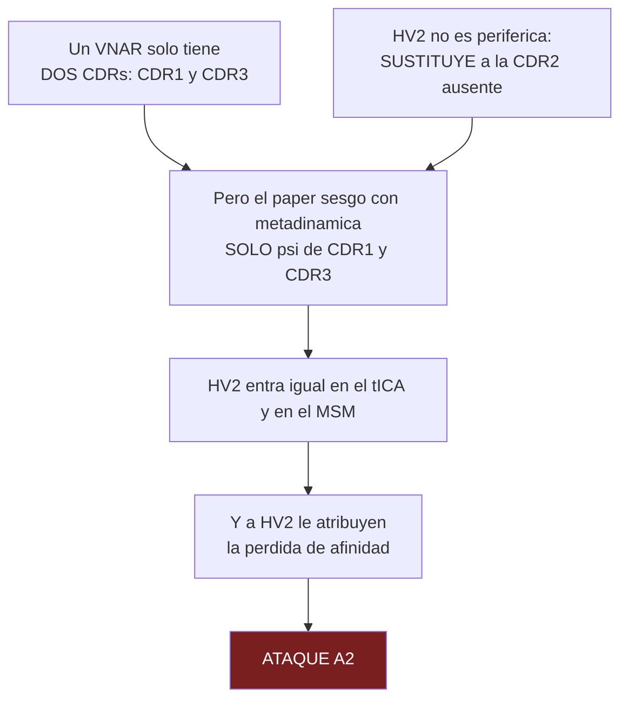

# 05 · Clase 0 — El VNAR

← [[00 MOC — Seminario VNAR]] · [[01 Plan de aprendizaje]] · siguiente: [[10 Clase 1 — El problema y el pivote]]

**Nodo:** `R4` del [[01 Plan de aprendizaje#3. Mapa de dependencias v2|mapa]].
**Fuente verificada:** Liu, Lin, Cao, Wang & Sui, *Front. Immunol.* **13**:1059771 (2022), PMC9720397, open access. Más los datos del propio paper.

---

## Por qué esta clase no es contexto decorativo

El sondeo confirmó que ya tienes el marco: **selección conformacional** — el antígeno captura un confórmero que ya estaba poblado, así que la afinidad depende de cuánto se puebla el estado competente. Eso es el techo del curso y está firme.

Lo que falta es la **anatomía**. Y no la necesitas para "dar contexto en la intro de la charla": la necesitas porque **de ella depende el ataque más fuerte que tienes contra el paper**.

Adelanto el destino para que sepas hacia dónde vamos, porque toda esta clase existe para poder decir esta frase con autoridad:

> [!danger] Adónde lleva esta clase
> El paper sesgó con metadinámica las torsiones de **CDR1 y CDR3**. Pero metió **HV2** en el tICA y en el MSM — y le atribuye a HV2 la pérdida de afinidad de la variante humanizada.
>
> Si HV2 fuera un loop periférico cualquiera, eso sería un descuido menor.
> Al terminar esta clase vas a saber por qué **no lo es**.

---

## 1 · Qué es un IgNAR, y qué es un VNAR

Los peces cartilaginosos —tiburones, rayas— son los organismos vivos **filogenéticamente más antiguos con un sistema inmune adaptativo basado en inmunoglobulinas**. Y produjeron una solución rarísima.

El **IgNAR** (*Immunoglobulin New Antigen Receptor*, descrito en 1995) es un anticuerpo natural **de solo cadena pesada**: no tiene cadena ligera en absoluto. Es un homodímero donde cada cadena aporta **un dominio variable** y **cinco dominios constantes**.

El dominio variable aislado —la parte que reconoce al antígeno— es el **VNAR**. Eso es lo que simula el paper.

> [!info] La familia de dominios de unión, para situarte
> | | Origen | Cadenas que forman el sitio | Nº de CDRs |
> |---|---|---|---|
> | **Fv / Fab** | mamífero convencional | VH **+** VL | 6 |
> | **VHH** («nanobody») | camélidos, solo cadena pesada | VH sola | 3 |
> | **VNAR** | tiburón, solo cadena pesada | VNAR solo | **2** |

![[assets/fig1-vnar-estructura.png]]
> **Figura 1 del paper.** *Izquierda:* el **IgNAR** completo — homodímero, cada cadena con **un** dominio variable ($V_{NAR}$) y **cinco** constantes ($C_{NAR}1$–$5$). Sin cadena ligera por ningún lado. *Centro:* el dominio **VNAR** aislado, con las cuatro regiones etiquetadas — **CDR1** y **CDR3** (las únicas dos CDR), y **HV2** y **HV4**. Fíjate en que HV2 (verde) recorre el **lateral** del dominio: ése es el «cinturón» del que hablaremos en §2. *Derecha:* el VNAR unido a la **HSA** (superficie gris) — mira el tamaño relativo. Ese bicho diminuto es todo el aparato de reconocimiento.

Fíjate en la última columna de la tabla, porque ahí está toda la historia.

Un Fv convencional construye su paratopo con **seis** loops repartidos entre dos dominios. Un nanobody prescinde de la cadena ligera y se queda con **tres**. Y el VNAR se queda con **dos** — es el **dominio de unión a antígeno más pequeño que existe de forma natural**.

Y aun así une HSA con alta afinidad. Esa es la tensión que hay que resolver: **¿cómo une algo tan bien con tan poco?**

---

> [!question] **Q1 · R4** — ¿Cuántos CDRs aporta el sitio de unión en cada caso?
>
> **a)** Fv convencional 6 · VHH 3 · VNAR 2
> **b)** Fv convencional 6 · VHH 3 · VNAR 3
> **c)** Fv convencional 6 · VHH 6 · VNAR 3
> **d)** Fv convencional 3 · VHH 3 · VNAR 2
>
> *(responde en el terminal — la explicación se añade aquí abajo al contestar)*

> [!success]- Respuesta Q1 → **a) 6 · 3 · 2** ✓ *(acertaste)*
> - **Fv convencional: 6.** El paratopo lo construyen **dos** dominios juntos, VH y VL, tres loops cada uno (H1 H2 H3 / L1 L2 L3).
> - **VHH: 3.** Se pierde la cadena ligera entera; queda un dominio con sus tres loops.
> - **VNAR: 2.** Se pierde la cadena ligera **y además** una de las tres CDRs del propio dominio. Solo quedan **CDR1 y CDR3**.
>
> La opción (b) era la confusión a detectar: tratar el VNAR como «el nanobody de los tiburones». No lo es — VHH y VNAR llegaron a ser de cadena única por caminos evolutivos **independientes**, y el VNAR fue más lejos.

---

## 2 · ¿Qué perdió exactamente, y con qué lo compensa?

Tenemos la tensión planteada: **dos loops, alta afinidad.** Algo tiene que estar compensando. Antes de que te lo diga, nota que *a priori* solo hay tres formas de compensar un paratopo pequeño:

1. Hacer los loops que quedan **más grandes**.
2. Hacerlos **más rígidos**, para no pagar entropía al unir.
3. Reclutar **superficie nueva** que en otros dominios no participaba.

El VNAR hace **las tres**. Y la tercera es la que nos interesa.

### La pérdida

En un dominio de inmunoglobulina normal, la CDR2 se apoya sobre las hebras β **C′ y C′′**. En el VNAR **esa región no está**. No es que la CDR2 esté acortada o poco diversa: es que **el and amiaje que la sostenía no existe**. Por eso el VNAR es el dominio de unión a antígeno más pequeño que se conoce de forma natural.

> [!bug] Corrección — el conteo de hebras que escribí primero estaba mal
> Escribí: *«un dominio Ig típico tiene 9 hebras y el VNAR tiene 8»*. **Enzo detectó que eso no cierra:** $9-2=7$, no 8. Tenía razón, y había copiado el número de la review sin auditar la aritmética.
>
> Al ir a la fuente primaria resultó que **el problema no es un typo, es que el conteo de hebras del plegamiento IgV es genuinamente ambiguo**, y por una razón concreta:
>
> > *«In IgVs, unlike IgCs, **the A strand splits in two** through a proline or a number of glycine residues and participates to the two sheets **A B E D** and **A′ | G F C C′ | C′′**.»*
> > — Youkharibache, *Biomolecules* **11**:1290 (2021), PMC8470474
>
> Es decir: en un dominio **IgV**, la hebra A se parte y contribuye a **las dos** láminas. Según la cuentes como una hebra o como dos segmentos (A y A′), el dominio tiene **9 o 10**. La review de la que saqué el dato usa 9 para el VHH («4 + 5», sin contar A′ aparte) pero luego dice 8 para el VNAR — y con su propio criterio debería dar 7. **La review se contradice a sí misma.**
>
> **Qué decir en la charla, entonces:** lo cualitativo está sólido y múltiplemente atestiguado — *el VNAR carece de CDR2 porque le falta la región C′/C′′ que la sostiene, y es el dominio de unión natural más pequeño*. **No cites un número de hebras**, o cita el rango y di que depende del convenio. Pendiente en [[99 Pendientes de verificación]].

> [!tip] Y esto es la clase entera, en miniatura
> Acabas de hacer, sobre mí, **exactamente lo que vas a tener que hacerle al paper de Liedl**: leer un número, comprobar si cierra con los otros números del mismo texto, y no dejarlo pasar cuando no cierra.
> Es literalmente el método del ataque [[22 Superficie de ataque#🔴 A1|A1]] — que sale de notar que 11.9 µs y 43.1 µs en la misma tabla no son comparables. Ninguna de las dos cosas requiere saber más que el autor: requiere **auditar la aritmética interna**.

### La compensación

La función de la CDR2 la asumen **dos regiones hipervariables** que en un anticuerpo convencional no son sitio de unión:

| Región  | Dónde está                                 | Papel                           |
| ------- | ------------------------------------------ | ------------------------------- |
| **HV2** | forma un **cinturón** que rodea el dominio | superficie de contacto lateral  |
| **HV4** | arriba del dominio, **opuesta a la CDR1**  | superficie de contacto superior |

Y en paralelo, las otras dos vías de compensación:
- **CDR3 gigantesca** — hasta **34 residuos** en VNARs, frente a los 8–12 típicos en humano. En el subtipo de la mielga sobresale como un dedo.
- **Disulfuros no canónicos** — cisteínas extra que atan loops entre sí y rigidizan el paratopo. Además del disulfuro conservado FR1(22Cys)–FR3(83Cys).

> [!important] La clave que cambia todo
> **HV2 y HV4 no son «loops de framework» ni decoración periférica. Son parte del aparato de reconocimiento** — están ahí precisamente *porque* falta la CDR2.
>
> Nomenclatura engañosa: se llaman «HV» y no «CDR», lo que hace fácil leerlas como secundarias. En un VNAR son **estructuralmente centrales**.

---

> [!question] **Q2 · R4** — ¿Qué es **HV2** en un VNAR?
>
> **a)** Una región hipervariable que ocupa el lugar funcional de la CDR2
> **b)** Un segmento conservado del framework que estabiliza el plegamiento
> **c)** La porción N-terminal de la CDR3 alargada
> **d)** El loop que une el dominio variable con el primer dominio constante
>
> *(responde en el terminal)*

---

## 2 bis · ¿Por qué «perder hebras» equivale a «no tener CDR2»?

Pregunta de Enzo, y señala un paso que me había saltado. Hay que separar **tres niveles** que es fácil mezclar: cadena → dominio → hebra.

### Nivel 1 · Cadena

Un anticuerpo convencional tiene **dos** tipos de cadena polipeptídica: pesada (H) y ligera (L).
Un **IgNAR no tiene cadena ligera en absoluto** — es solo cadena pesada. Así que la pregunta «¿esas hebras son de la pesada o de la ligera?» no aplica: **en un IgNAR solo hay una clase de cadena**.

### Nivel 2 · Dominio

Una cadena se pliega en **dominios**, y cada dominio es una unidad de plegamiento independiente. El dominio variable —VH, VL, VHH o VNAR— adopta siempre el mismo plegamiento: el **plegamiento de inmunoglobulina tipo V (IgV)**, un sándwich de dos láminas β.

### Nivel 3 · Hebra

Aquí está la clave que faltaba:

> [!important] Las hebras A, B, C, C′, C′′, D, E, F, G **no son «de la cadena pesada» ni «de la ligera»**
> Son las hebras **de un dominio IgV cualquiera**. Un VH las tiene, un VL las tiene, un VHH las tiene y un VNAR (casi) las tiene. Es la nomenclatura estándar del **plegamiento**, no de la cadena. Todas pertenecen a **un solo polipéptido**, el del propio dominio.

### Y ahora el paso lógico que faltaba

Lo que hay que saber es **qué es una CDR estructuralmente**:

> [!success] La definición que resuelve tu pregunta
> Una **CDR no es una hebra β: es el lazo (*loop*) que conecta dos hebras β consecutivas.**

Y cada CDR tiene sus dos hebras asignadas, siempre las mismas:

| CDR | Es el lazo entre… |
|---|---|
| **CDR1** | hebra **B** → hebra **C** |
| **CDR2** | hebra **C′** → hebra **C′′** |
| **CDR3** | hebra **F** → hebra **G** |

*(Confirmado en la fuente primaria: Youkharibache describe el conector como «[CDR2 – C′′ strand – C′′D loop]», o sea CDR2 justo antes de C′′.)*

Así que el orden a lo largo del polipéptido es:

```
IgV normal   N— A ·A′· B —[CDR1]— C · C′ —[CDR2]— C′′ · D · E · F —[CDR3]— G —C

VNAR         N— A ·A′· B —[CDR1]— C ·············· D · E · F —[CDR3]— G —C
                                       ↑
                            aquí no hay nada que conectar
```

**Ahí está la implicación, y es puramente geométrica:** si las hebras C′ y C′′ no existen, entonces **el lazo que las uniría tampoco existe**. Y ese lazo *era* la CDR2.

> [!note] Sobre la dirección de la causalidad
> Cuidado con leerlo como «perdió las hebras **y por eso** perdió la CDR2», como si fueran dos eventos. Son **el mismo hecho descrito a dos niveles**: el gen codifica un segmento más corto → estructuralmente faltan C′/C′′ → funcionalmente no hay CDR2. Una sola pérdida, dos descripciones.
>
> Y ahora encaja lo de HV2/HV4: si te quedas sin el lazo del medio, la única forma de recuperar superficie de unión es **reclutar otras zonas del dominio** que antes no tocaban al antígeno. Eso es exactamente lo que son HV2 y HV4.

---

> [!question] **Q3 · R4** — ¿Por qué la ausencia de las hebras C′ y C′′ implica que no hay CDR2?
>
> **a)** Porque la CDR2 es el lazo que conecta C′ con C′′
> **b)** Porque C′ y C′′ forman ellas mismas la superficie de contacto de la CDR2
> **c)** Porque C′ y C′′ estabilizan el lazo CDR2, aunque no lo formen
> **d)** Porque la CDR2 se codifica en el mismo exón que C′ y C′′
>
> *(responde en el terminal)*

> [!success]- Respuesta Q2 → **a) Una región hipervariable que ocupa el lugar funcional de la CDR2** ✓
> HV2 es **hipervariable** —diversa en secuencia, como una CDR— y forma un cinturón alrededor del dominio. Junto con HV4 es la compensación estructural por la región C′/C′′ ausente.
> La opción (b) era la trampa, y es el error que **el propio nombre invita a cometer**: como se llama «HV» y no «CDR», es tentador archivarla como framework. Quien crea eso, no puede ver el ataque A2.

> [!success]- Respuesta Q3 → **a) Porque la CDR2 es el lazo que conecta C′ con C′′** ✓
> La implicación es puramente geométrica: sin C′ ni C′′ no hay dos extremos que conectar, luego no hay lazo — y ese lazo *era* la CDR2.
>
> La opción (b) era la importante de desalojar, porque contamina todo lo demás. Si las CDRs *fueran* hebras, no se entendería por qué son la parte variable. La lógica es al revés:
>
> | Hebras β | Lazos |
> |---|---|
> | forman el armazón del sándwich | sobresalen del armazón |
> | **conservadas** | **variables** — toleran cambios de longitud y secuencia |
> | rígidas | **flexibles** |
>
> Armazón conservado, lazos variables. Y de la última fila sale algo que usarás en la Clase 1: **el paper simula dinámica de lazos porque los lazos son lo único que se mueve.** Cuando eligen sesgar las torsiones $\psi$ de CDR1 y CDR3, están eligiendo los grados de libertad que realmente tienen movimiento.

---

## 3 · Qué significa humanizar aquí

Un VNAR es una proteína **de tiburón**. Inyectada en un paciente humano, el sistema inmune la reconoce como extraña y genera anticuerpos anti-fármaco. **Humanizar = reducir esa inmunogenicidad** sustituyendo residuos por sus equivalentes humanos.

La regla básica: **se toca el framework, no las CDRs** — porque las CDRs son las que unen al antígeno. Suena seguro. Este paper existe para demostrar que **no lo es**.

![[assets/fig2-alineamiento-hidrofobicidad.png]]
> **Figura 2 del paper.** *Abajo:* el alineamiento de secuencias. Las cajas marcan **CDR1, HV2, HV4 y CDR3**. En **azul**, los residuos ya idénticos a la germinal humana DPK9; en **verde/amarillo/morado**, las mutaciones que añade cada variante; y en **naranja**, el motivo **`RKN`** que v1.10 **revierte** — se ve nítidamente cómo v1.1–v1.4 lo cambian a `QQK` y v1.10 lo devuelve.
> *Arriba a la derecha:* la comparación clave de superficie — **E06** frente a **DPK9 (Vκ1)**, coloreadas por hidrofobicidad (naranja = hidrofóbico). El parche naranja central de DPK9 es su cara de apareamiento con el VH. El VNAR **no lo tiene**: vive solo.

### La cadena de variantes

| Variante                     | Qué es                                                                 |
| ---------------------------- | ---------------------------------------------------------------------- |
| **E06**                      | el parent, VNAR de mielga (*Squalus acanthias*), alta afinidad por HSA |
| **huE06 v1.1 → v1.2 → v1.4** | mutaciones humanizantes acumuladas                                     |
| **huE06 v1.10**              | **revierte** el motivo `RKN`                                           |
| **DPK9**                     | referencia: línea germinal humana **Vκ1**, cadena **ligera**           |

> [!tip] El diseño experimental más fuerte del paper
> La variante **v1.10 es un control interno de reversión**. Si humanizar rompe la unión, revertir el motivo crítico debería restaurarla — y eso es exactamente lo que observan, tanto en el experimento de Kovalenko como en sus simulaciones.
> Es el argumento más difícil de atacar que tienen. Guárdatelo: cuando en la Clase 6 montemos la crítica, **hay que reconocer esto primero** o pareces sesgado.

### Un detalle con consecuencias

La referencia humana es una **cadena ligera** (Vκ1), no una pesada. Y un VL normalmente **vive apareado a un VH**: tiene una cara hidrofóbica destinada a ese contacto.

Un VNAR, en cambio, vive **solo**. Esa misma cara está expuesta al solvente, y por eso es **más hidrofílica** — es justo lo que muestra la Fig. 2B del paper.

De ahí el riesgo estructural de esta humanización, que el paper detecta: acercar el VNAR a un Vκ1 humano tiende a **devolver hidrofobicidad a una cara que ya no tiene con quién aparearse**. Es el mismo principio que en los nanobodies, donde los residuos *hallmark* sustituyen la cara hidrofóbica de apareamiento por una hidrofílica.

---

## 4 · La síntesis — para qué era todo esto

Ahora tienes las tres piezas juntas:



![[assets/fig5-contactos-hsa.png]]
> **Figura 5 del paper — la evidencia sobre la que se apoya el claim de HV2.** Compara la red de contactos **E06–HSA** (izquierda) con **huE06 v1.1–HSA** (derecha).
> *Arriba izquierda:* mapa de frecuencias de contacto — la columna de E06 tiene valores de 0.7–0.99, y la de v1.1 se desploma a 0–0.21. *Centro:* los residuos implicados, coloreados por frecuencia; se ve cómo v1.1 pierde contactos enteros. *Abajo derecha:* la distribución de número de contactos se desplaza a la baja en v1.1.
>
> **Y aquí está el punto:** a partir de esta figura el paper concluye que la pérdida de afinidad viene de *«missing interactions with the **HV2** loop and the framework»*.
> O sea que **HV2 sostiene la conclusión biológica del paper** — el mismo lazo que nunca recibió sesgo.

> [!danger] Tu ataque A2, ya defendible línea por línea
> *«No aplicaron muestreo mejorado al lazo que hace las veces de CDR2, en el dominio de unión a antígeno más pequeño que existe — y aun así lo incluyeron en el modelo cinético y basaron en él su conclusión biológica. ¿En qué se apoya que el espacio conformacional de HV2 esté convergido?»*

---

> [!question] **Q4 · cierre de Clase 0** — ¿Cuál es el tratamiento que el paper le dio a HV2?
>
> **a)** Entró en el tICA y en el MSM, pero nunca fue una CV de metadinámica
> **b)** Fue una CV de metadinámica, pero no entró en el MSM
> **c)** Fue tanto CV de metadinámica como feature del MSM
> **d)** No aparece ni en la metadinámica ni en el MSM
>
> *(responde en el terminal)*

> [!success]- Respuesta Q4 → **a) Entró en el tICA y en el MSM, pero nunca fue una CV de metadinámica** ✓
> **Asimetría.** El paper, textualmente, en sus dos etapas:
>
> | Etapa | Cita | ¿HV2? |
> |---|---|---|
> | Metadinámica | *«As collective variables, we used a linear combination of sine and cosine of the $\psi$ torsion angles of the **CDR1 and CDR3** loops»* | ❌ |
> | tICA | *«Based on the backbone torsion of the **CDR1, CDR3 and HV2** loops, a tICA was performed»* | ✅ |
> | MSM | *«…based on the backbone torsions of the **CDR1, CDR3 and HV2** loops»* | ✅ |
>
> **HV2 se mide, pero no se muestrea.** Su conformación se exploró solo con MD clásica de 100 ns por semilla — y en la Clase 1 vas a calcular con números exactamente qué barreras **no** se cruzan en 100 ns.

---

## Resumen — Clase 0

| Pieza | Contenido | ✓ |
|---|---|---|
| Familia | Fv 6 CDRs · VHH 3 · **VNAR 2** | Q1 |
| Pérdida | falta la región **C′/C′′**, y con ella la CDR2 | Q3 |
| Compensación | **HV2** (cinturón) y **HV4**, + CDR3 larga + disulfuros no canónicos | Q2 |
| Definición clave | **una CDR es un lazo entre dos hebras**, no una hebra | Q3 |
| Corolario | armazón conservado y rígido · lazos variables y **flexibles** | → Clase 1 |
| Humanizar | tocar framework, no CDRs — referencia **DPK9 (Vκ1 ligera)**; **v1.10 revierte `RKN`** | — |
| Munición | **A2**: HV2 se mide pero no se muestrea | Q4 |

**Nodo `R4` instalado.** → siguiente: [[10 Clase 1 — El problema y el pivote]]
