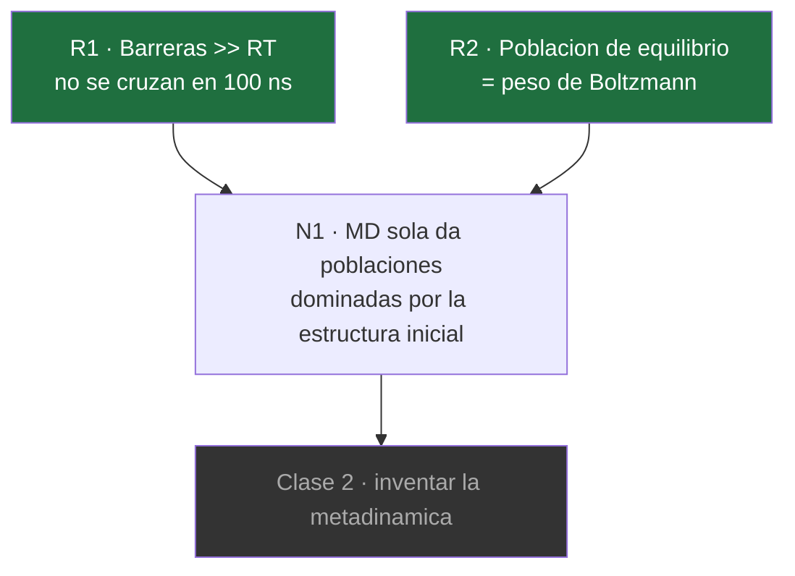

# 10 · Clase 1 — Por qué la MD sola no basta

← [[00 MOC — Seminario VNAR]] · [[01 Plan de aprendizaje]] · siguiente: *Clase 2 (pendiente)*

> [!warning] Borrador — pendiente tu OK al [[01 Plan de aprendizaje|plan]]
> Escribo esta clase porque cubre los tres nodos que **no cambian** aunque reordenes el resto: son la base. Si apruebas el plan, seguimos; si lo cambias, esta clase sobrevive igual.

**Nodos de esta clase:** `R1` `R2` → `N1` del [[01 Plan de aprendizaje#2. Mapa de dependencias|mapa]].
**Meta:** al final deberías poder responder, con números, *por qué el paper no podía limitarse a correr MD*.

---

## Nodo R2 · Población de equilibrio = peso de Boltzmann

### Motivación: ¿por qué empezar por aquí?

Porque **la conclusión entera del paper es un número de población**: 92 % → 16 %. Antes de discutir cómo se calcula ese número, hay que tener clarísimo **qué es**. Si "población" queda vago, todo lo demás flota.

### Establecer

> [!success] Verdad incondicional R2
> En equilibrio a temperatura $T$, la probabilidad de un estado no depende de nada más que de su energía libre:
> $$\frac{P_A}{P_B} = e^{-(G_A - G_B)/RT}$$
> Sin matices. No importa cómo llegó el sistema ahí, ni por qué camino, ni cuánto tardó. **Solo** $\Delta G$ y $T$.

Y el número que hay que tener en la cabeza para el resto del seminario:

$$RT = 8.314 \times 300 = 2494\ \text{J/mol} \approx \mathbf{2.5\ \text{kJ/mol}} \quad (T = 300\ \text{K})$$

Eso es la unidad natural de todo lo que sigue. Cada vez que veas una energía en este paper, divídela mentalmente por 2.5.

### Conectar

Esto es una **definición operativa**, no un teorema: te dice *qué medir*. La consecuencia inmediata, y es la que usaremos sin parar: si quieres poblaciones, necesitas que tu muestreo haya visitado los estados **en proporción a su peso de Boltzmann**. Un muestreo que visitó los estados correctos pero en las proporciones equivocadas es tan inútil como uno que no los visitó.

Guárdate esa frase. Es, literalmente, la crítica [[22 Superficie de ataque#🟠 A6 — ¿Las "superficies de energía libre" de la Fig. 3A están reponderadas?|A6]] del paper.

> [!question] **Q1 · R2** — Dos confórmeros de un loop CDR difieren en $\Delta G = 10$ kJ/mol a 300 K. ¿Qué poblaciones relativas tienen?
> **a)** ≈ 98 % / 2 %
> **b)** ≈ 90 % / 10 %
> **c)** ≈ 73 % / 27 %
> **d)** ≈ 50 % / 50 %, porque 10 kJ/mol es despreciable frente a la energía térmica

> [!success]- Respuesta Q1
> **a) ≈ 98 % / 2 %.**
> $$\frac{P_B}{P_A} = e^{-10/2.494} = e^{-4.01} = 0.018$$
> → 1.8 % frente a 98.2 %. La lección de calibración: **10 kJ/mol ya es una diferencia brutal de población** — un factor 55. Por eso la termodinámica de proteínas vive en una ventana de energías tan estrecha, y por eso 2.5 kJ/mol es un error grande, no pequeño.
> La opción **d)** es la trampa que importa: confunde $RT$ con "energía térmica total del sistema". Un enlace tiene ~400 kJ/mol y las energías cinéticas son enormes, pero lo que gobierna las **poblaciones relativas** es $\Delta G/RT$, y ahí 10/2.5 = 4 es un exponente grande.

> [!question] **Q2 · R2 — la que de verdad importa** — En el paper, el estado competente pasa de **92 %** (E06) a **16 %** (huE06 v1.1). ¿Cuánta diferencia de energía libre representa ese cambio tan dramático?
> **a)** ≈ 10 kJ/mol
> **b)** ≈ 45 kJ/mol
> **c)** ≈ 120 kJ/mol
> **d)** ≈ 0.5 kJ/mol

> [!success]- Respuesta Q2
> **a) ≈ 10 kJ/mol** (≈ 2.4 kcal/mol).
> Tratando cada caso como "estado competente vs. todo lo demás":
> $$\Delta\Delta G = -RT\left[\ln\frac{0.92}{0.08} - \ln\frac{0.16}{0.84}\right] = -2.494\,[2.44 - (-1.66)] \approx -10.2\ \text{kJ/mol}$$
> **Y aquí está el punto de la clase entera:** el hallazgo central del paper — un colapso de población que *suena* enorme, 92 % → 16 % — vive en **≈ 10 kJ/mol**, unas 4 unidades de $RT$.
>
> Eso corta en dos direcciones y hay que saber usar las dos:
> - **A favor:** 10 kJ/mol es una magnitud perfectamente razonable para un puñado de mutaciones puntuales. El resultado es físicamente plausible.
> - **En contra:** también es una magnitud **comparable a la incertidumbre de ff14SB** en preferencias torsionales de backbone acumuladas sobre loops de 10–15 residuos. La conclusión del paper vive dentro de la barra de error del campo de fuerza.
>
> Ese es el ataque [[22 Superficie de ataque#🟡 A11 — La conclusión vive en ≈10 kJ/mol|A11]], y ahora sabes derivarlo, no recitarlo.

---

## Nodo R1 · Las barreras altas no se cruzan

### Motivación

Ya sabes *qué* quieres medir (R2: poblaciones). La pregunta obvia siguiente es: **¿por qué no basta con correr MD y contar?** Es lo que haría cualquiera. Necesitamos ver por qué falla — y verlo con números, no con un "es que es muy lento".

### Establecer

> [!success] Verdad incondicional R1
> La tasa de cruce de una barrera decae **exponencialmente** con su altura:
> $$k \approx k_0\, e^{-\Delta G^\ddagger / RT}$$
> Y por tanto el tiempo de espera medio $\tau = 1/k$ crece exponencialmente. Sin matices: es la forma de Arrhenius/Kramers, y el prefactor $k_0$ para reorganización conformacional en solvente es del orden de $10^{11}\ \text{s}^{-1}$.

Lo importante es que **exponencial** significa que no hay negociación posible. No es que una barrera alta sea "más lenta"; es que salta órdenes de magnitud enteros por cada pocos kJ/mol.

### Conectar: hazlo tú (socrático)

Aquí quiero que hagas la cuenta, porque el resultado es el que justifica todo el paper.

> [!question] **Q3 · R1** — Barrera de **40 kJ/mol** a 300 K, con $k_0 = 10^{11}\ \text{s}^{-1}$. ¿Cuál es el tiempo de espera medio?
> **a)** ≈ 90 µs
> **b)** ≈ 90 ns
> **c)** ≈ 90 ps
> **d)** ≈ 90 ms

> [!success]- Respuesta Q3
> **a) ≈ 90 µs.**
> $$\frac{\Delta G^\ddagger}{RT} = \frac{40}{2.494} = 16.0 \qquad e^{-16.0} = 1.1\times10^{-7}$$
> $$k = 10^{11} \times 1.1\times10^{-7} = 1.1\times10^{4}\ \text{s}^{-1} \qquad \tau = \frac{1}{k} \approx 90\ \mu\text{s}$$
> Ahora el remate: **las trayectorias sembradas del paper duran 100 ns.** El número esperado de cruces en una de ellas es
> $$1.1\times10^{4}\ \text{s}^{-1} \times 10^{-7}\ \text{s} \approx 10^{-3}$$
> Una posibilidad en mil. **Ese cruce no ocurre. Nunca.**

> [!question] **Q4 · R1** — Con los mismos números, ¿qué barrera **sí** se cruza cómodamente varias veces en 100 ns?
> **a)** ≈ 20 kJ/mol
> **b)** ≈ 35 kJ/mol
> **c)** ≈ 60 kJ/mol
> **d)** ninguna: en 100 ns no se cruza ninguna barrera

> [!success]- Respuesta Q4
> **a) ≈ 20 kJ/mol.**
> $$20/2.494 = 8.0 \qquad e^{-8.0} = 3.4\times10^{-4} \qquad k = 3.4\times10^{7}\ \text{s}^{-1} \qquad \tau \approx 30\ \text{ns}$$
> Unos 3 cruces en 100 ns. **Ahí está la frontera:** la MD accesible te da barreras de hasta ~20–25 kJ/mol y nada más. La ventana entre 25 y 40 kJ/mol es exactamente donde viven las transiciones de loops CDR — y es un agujero ciego.
> La opción **d)** es la sobrecorrección típica: sí se cruzan barreras en 100 ns, muchas. El problema no es que la MD no cruce nada, es que **cruza unas y no otras**, y no te avisa de cuáles se perdió.
>
> Contexto que confirma la escala: el propio grupo Liedl tituló un paper *"Transitions of CDR-L3 Loop Canonical Cluster Conformations on the **Micro-to-Millisecond** Timescale"* ([[24 Referencias verificadas|Front. Immunol. 2019]]). Ellos mismos sitúan estas transiciones en µs–ms.

---

## Nodo N1 · Por tanto: la MD sola da poblaciones falsas

### Motivación

Ya tenemos las dos piezas. Ahora hay que **juntarlas**, porque de la unión sale el problema que el pipeline entero existe para resolver.

### Establecer — la derivación

Es un silogismo, y quiero que veas que no hay ningún paso de fe:

1. **De R2:** para tener poblaciones necesito visitar los estados con frecuencia proporcional a $e^{-G/RT}$.
2. **De R1:** en 100 ns solo cruzo barreras ≲ 25 kJ/mol; las de 40 kJ/mol son inatravesables.
3. Si los estados relevantes están separados por barreras de 40 kJ/mol, mi trayectoria **se queda en la cuenca donde empezó**.
4. Entonces la frecuencia con que visito cada estado no refleja $e^{-G/RT}$: refleja **dónde puse la estructura inicial**.

> [!failure] Nodo N1
> Una MD clásica más corta que el tiempo de espera de las transiciones relevantes no mide poblaciones de equilibrio. Mide **tu elección de estructura de partida**.

### Conectar — y por qué esto es fatal *para este paper en particular*

Fíjate en la trampa doble. El paper compara seis sistemas y sus estructuras de partida son:

| Sistema | Origen |
|---|---|
| E06, huE06 v1.1 | X-ray (`4HGK`, `4HGM`) — **y cristalizadas con antígeno** |
| v1.2, v1.4, v1.10, DPK9 | **AlphaFold2** |

Con MD sola, cada sistema quedaría atrapado cerca de su punto de partida. Y como los puntos de partida vienen de **fuentes distintas**, las "poblaciones" resultantes serían un artefacto de la procedencia estructural, no una propiedad de las secuencias. Peor: las dos estructuras de X-ray están en conformación **unida a antígeno**, es decir ya sesgadas hacia el estado competente — precisamente el estado cuya población se quiere medir.

> [!tip] La consecuencia estratégica
> Esto es lo que hace que el problema de muestreo **no sea un detalle técnico sino la amenaza principal a la validez del paper**. Sin resolverlo, el resultado central (92 % vs 16 %) sería indistinguible de "cristalicé una con antígeno y la otra la predijo AF2".
> Y de aquí sale, con el signo correcto, el ataque [[22 Superficie de ataque#🟠 A5 — AlphaFold2 confundido con la identidad de la variante|A5]].

> [!question] **Q5 · N1 — cierre** — ¿Cuál es la razón precisa por la que la MD clásica sola no puede responder la pregunta del paper?
> **a)** Porque el muestreo queda confinado a la cuenca inicial, así que las poblaciones observadas reflejan la estructura de partida
> **b)** Porque ff14SB no es lo bastante preciso para energías libres conformacionales
> **c)** Porque 100 ns no alcanzan a equilibrar el solvente alrededor de los loops
> **d)** Porque la MD clásica es determinista y no puede generar una distribución de Boltzmann

> [!success]- Respuesta Q5
> **a)**. Es exactamente la cadena R1 + R2 → N1: barreras inatravesables ⇒ confinamiento ⇒ las frecuencias observadas codifican la condición inicial, no $e^{-G/RT}$.
> Por qué las otras son errores reales y distintos:
> - **b)** es un problema **de verdad** (es el ataque A11 que derivaste en Q2), pero es **ortogonal**: aunque ff14SB fuera exacto, seguirías sin cruzar la barrera. Confundir un error de *modelo* con un error de *muestreo* es la confusión más común en esta área, y hay que tenerla separada para criticar bien.
> - **c)** invierte las escalas: la reorganización del solvente ocurre en ps–ns, está de sobra convergida en 100 ns. Ese no es el cuello de botella.
> - **d)** confunde determinismo de la trayectoria con ergodicidad. La MD **sí** genera muestreo de Boltzmann — con un termostato correcto y **tiempo suficiente**. El problema es únicamente el tiempo.

---

## Resumen — qué queda instalado

| Nodo | Contenido | Comprobado |
|---|---|---|
| **R2** | Poblaciones $= e^{-\Delta G/RT}$; $RT \approx 2.5$ kJ/mol a 300 K | Q1, Q2 |
| **R1** | $\tau \sim e^{+\Delta G^\ddagger/RT}$; en 100 ns el techo son ~25 kJ/mol | Q3, Q4 |
| **N1** | MD sola ⇒ poblaciones = estructura inicial, no equilibrio | Q5 |

Y dos números para llevarse:
- **$RT \approx 2.5$ kJ/mol** a 300 K.
- **≈ 10 kJ/mol** es todo lo que hay detrás del titular 92 % → 16 %.

> [!abstract] Adónde va esto (Clase 2)
> Tenemos el problema perfectamente definido: **hay que cruzar barreras de 40 kJ/mol sin esperar 90 µs por cruce.** La Clase 2 es socrática y empieza con una sola pregunta:
> *Si no puedes bajar la barrera cambiando la física ni esperar a que se cruce sola… ¿qué te queda?*
> La respuesta que se te ocurra va a ser, muy probablemente, metadinámica. Ese es el punto: que el método se sienta **descubierto**, no decretado.
