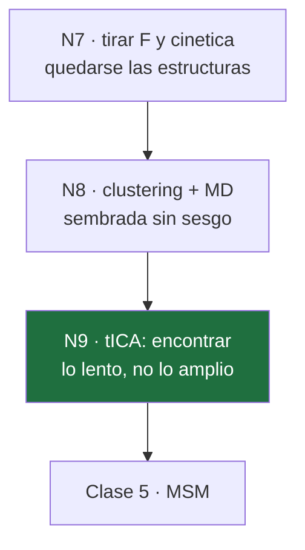

# 13 · Clase 4 — tICA

← [[00 MOC — Seminario VNAR]] · anterior: [[12 Clase 3 — El precio]]

**Nodos:** `N8` (MD sembrada sin sesgo) → `N9` (tICA: lo lento, no lo amplio).

---

## 1 · `N8` — De vuelta a MD sin sesgo

### Motivación

En la Clase 3 decidimos algo drástico: tirar la energía libre y la cinética de la metadinámica, y quedarnos **solo con las estructuras** que visitó. Pregunta obvia: ¿qué se hace con un microsegundo de trayectoria sesgada llena de estructuras?

### Establecer

No se puede analizar cada frame — son millones. Se **resume**:

1. **Clustering jerárquico** (*average linkage*, `cpptraj`), corte de distancia **1.3 Å** → reduce el microsegundo a un puñado de representantes estructuralmente distintos.
2. Cada representante se re-equilibra y se lanza a **100 ns de MD sin sesgo** (AMBER 20, `pmemd.cuda`).

### Conectar

El resultado son muchas trayectorias **cortas y físicas** — sin sesgo, así que dentro de cada una la dinámica es real. Pero heredan un problema que ya conoces exactamente:

$$
\hat F(s) = F(s) - RT\ln\frac{w_i}{\pi_i}
$$

El número de clusters por región fija $w_i$, y nada garantiza $w_i=\pi_i$. **Ese problema sigue vivo** — y es precisamente lo que el MSM (Clase 5) va a reparar. Antes de llegar ahí, hace falta **organizar** estas trayectorias de alguna forma manejable: eso es tICA.

---

> [!question] **Q1 · N8** — Después del clustering y la MD sembrada sin sesgo, ¿qué tienen exactamente estas nuevas trayectorias?
>
> **a)** Física local correcta dentro de cada una, pero pesos de siembra $w_i$ que en general no son $\pi_i$
> **b)** Las poblaciones de equilibrio correctas, porque ya no hay sesgo
> **c)** El mismo problema que las trayectorias de metadinámica: dinámica no física
> **d)** Trayectorias demasiado cortas para tener ninguna física correcta

> [!success]- Respuesta Q1 → **a) Física correcta, pesos aún mal** ✓
> Estas trayectorias son MD **sin sesgo** — dentro de cada una la dinámica es real. Eso las distingue de las trayectorias de metadinámica, donde $V(s,t)$ deformaba activamente la dinámica.
> Pero heredan el problema de **cómo se sembraron**: el número de clusters por región fija $w_i$, y nada garantiza $w_i=\pi_i$.
> **Física correcta dentro de la cuenca, incapaz aún de decirte las poblaciones entre cuencas.** Ahí arranca tICA.

---

## 2 · `N9` — tICA: encontrar lo lento, no lo amplio

### 2.1 · Motivación

Tienes cientos de trayectorias cortas, cada una viviendo en un espacio de **muchas** coordenadas — las torsiones $\psi$ de CDR1, CDR3 y HV2, más sus combinaciones. Para poder *ver* algo — como los paisajes de la Fig. 3 y la Fig. 4 — hace falta **proyectar a 2 dimensiones**. La pregunta es sobre qué proyectar.

### 2.2 · La respuesta ingenua, y por qué falla

Lo primero que se le ocurre a cualquiera: **PCA**, la dirección de mayor varianza.

> [!question] Antes de seguir — piénsalo
> Imagina dos grados de libertad en el mismo lazo: uno es la punta del lazo **agitándose** con amplitud grande (varía mucho, se relaja en $\sim$10 ps). El otro es un **cambio conformacional real** entre dos cuencas, con amplitud pequeña pero que tarda $\sim$10 µs en revertirse. ¿Cuál elige PCA como componente principal? ¿Es la que te interesa?

PCA **no distingue entre rápido y lento** — solo mide cuánto se mueve una coordenada, no cuánto tarda en "olvidar" de dónde vino. La punta agitándose tiene más varianza y gana, aunque sea irrelevante para separar estados metaestables.

> [!important] Lo que hace falta
> No una dirección de **mucho movimiento**. Una dirección que **tarde en decorrelacionarse** — que hoy y dentro de un rato $\tau$ sigan pareciéndose. Eso es *lento* en el sentido que importa.

### 2.3 · Formalizar "tarda en decorrelacionarse"

Sea $\mathbf{x}(t)\in\mathbb{R}^d$ el vector de *features* en el tiempo $t$ (las torsiones, ya centradas: $\langle\mathbf{x}\rangle=0$). Busca la combinación lineal $y(t) = \mathbf{v}^\top\mathbf{x}(t)$ con la **autocorrelación a un lag $\tau$** más alta:

$$
\rho(\mathbf{v},\tau) \;=\; \frac{\langle y(t)\,y(t+\tau)\rangle}{\langle y(t)^2\rangle}
$$

### 2.4 · La derivación, paso a paso

**Paso 1** — sustituye $y(t)=\mathbf{v}^\top\mathbf{x}(t)$ en el numerador. Como $y(t)y(t+\tau)$ es un escalar, se puede escribir como una forma cuadrática:

$$
y(t)\,y(t+\tau) = \big(\mathbf{v}^\top\mathbf{x}(t)\big)\big(\mathbf{x}(t+\tau)^\top\mathbf{v}\big) = \mathbf{v}^\top\, \mathbf{x}(t)\mathbf{x}(t+\tau)^\top\, \mathbf{v}
$$

**Paso 2** — toma valor esperado. Usando estacionariedad (no depende de $t$, solo de $\tau$):

$$
\langle y(t)y(t+\tau)\rangle = \mathbf{v}^\top \underbrace{\langle\mathbf{x}(t)\mathbf{x}(t+\tau)^\top\rangle}_{\displaystyle C(\tau)}\, \mathbf{v}
$$

$C(\tau)$ es la **matriz de covarianza desfasada**: en la posición $(i,j)$ guarda cuánto covarían la feature $i$ ahora con la feature $j$ dentro de $\tau$.

**Paso 3** — el denominador es el caso particular $\tau=0$:

$$
\langle y(t)^2\rangle = \mathbf{v}^\top \underbrace{\langle\mathbf{x}(t)\mathbf{x}(t)^\top\rangle}_{\displaystyle C(0)}\, \mathbf{v}
$$

$C(0)$ es la covarianza **instantánea** — exactamente la matriz que usa PCA.

$$
\rho(\mathbf{v},\tau) = \frac{\mathbf{v}^\top C(\tau)\,\mathbf{v}}{\mathbf{v}^\top C(0)\,\mathbf{v}}
$$

> [!important] Ya se ve la diferencia con PCA
> PCA maximiza $\mathbf{v}^\top C(0)\mathbf{v}$ solo — el numerador de tICA es $C(\tau)$, no $C(0)$: **premia que la señal sobreviva** un tiempo $\tau$, no que sea grande ahora.

### 2.5 · Maximizar el cociente

Es un cociente de Rayleigh generalizado. Deriva respecto a $\mathbf{v}$ e iguala a cero. Con $f=\mathbf{v}^\top C(\tau)\mathbf{v}$, $g=\mathbf{v}^\top C(0)\mathbf{v}$:

$$
\nabla\rho = \frac{g\,\nabla f - f\,\nabla g}{g^2} = 0 \;\;\Longrightarrow\;\; g\,\nabla f = f\,\nabla g
$$

Usando $\nabla(\mathbf{v}^\top A\mathbf{v}) = 2A\mathbf{v}$ para $A$ simétrica *(por eso $C(\tau)$ se simetriza en la práctica — ver aviso abajo)*:

$$
g\cdot 2C(\tau)\mathbf{v} = f\cdot 2C(0)\mathbf{v} \;\;\Longrightarrow\;\; C(\tau)\,\mathbf{v} = \frac{f}{g}\,C(0)\,\mathbf{v}
$$

Y $f/g = \rho(\mathbf{v},\tau)$ por definición. Llamando $\lambda\equiv\rho$:

$$
\boxed{\;C(\tau)\,\mathbf{v} = \lambda\, C(0)\,\mathbf{v}\;}
$$

> [!success] El problema de autovalores generalizado, y lo que significa
> Es exactamente el mismo tipo de ecuación que $A\mathbf{v}=\lambda\mathbf{v}$, salvo que ahora hay **dos** matrices. El autovector de **mayor** $\lambda$ es la dirección de máxima autocorrelación — y $\lambda$ mismo **es** el valor de esa autocorrelación en el óptimo.

> [!warning] Detalle técnico — por qué se simetriza $C(\tau)$
> $\langle\mathbf{x}(t)\mathbf{x}(t+\tau)^\top\rangle$ no es simétrica en general. PyEMMA la simetriza: $C(\tau)\to\frac{1}{2}[C(\tau)+C(\tau)^\top]$. Eso equivale a asumir que el proceso es **reversible** — la misma propiedad de balance detallado que vas a necesitar para estimar el MSM en la Clase 5. No es casualidad: es el mismo supuesto reapareciendo.

---

> [!question] **Q2 · N9** — ¿Por qué tICA maximiza $\mathbf{v}^\top C(\tau)\mathbf{v} / \mathbf{v}^\top C(0)\mathbf{v}$ en vez de maximizar solo $\mathbf{v}^\top C(0)\mathbf{v}$ (PCA)?
>
> **a)** Porque el cociente premia que la señal siga correlacionada tras un tiempo $\tau$, no solo que tenga amplitud grande ahora
> **b)** Porque $C(\tau)$ siempre da valores más grandes que $C(0)$, así que el cociente es más fácil de maximizar
> **c)** Porque $C(0)$ no es invertible cuando hay muchas features correlacionadas
> **d)** Porque maximizar solo $C(0)$ requiere más datos que maximizar el cociente
