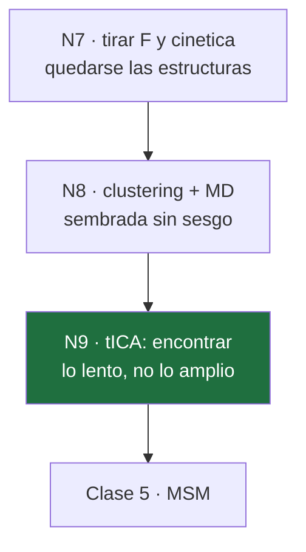

# 13 · Clase 4 — tICA

← [[00 MOC — Seminario VNAR]] · anterior: [[12 Clase 3 — El precio]]

**Nodos:** `N8` (MD sembrada sin sesgo) → `N9` (tICA: lo lento, no lo amplio).

---

## 1 · `N8` — De vuelta a MD sin sesgo

### Motivación

En la Clase 3 decidimos algo drástico: tirar la energía libre y la cinética de la metadinámica, y quedarnos **solo con las estructuras** que visitó. Pregunta obvia: ¿qué se hace con un microsegundo de trayectoria sesgada llena de estructuras?

### Establecer

No se puede analizar cada frame — son millones. Se **resume**:

1. **Clustering jerárquico** (*average linkage*, `cpptraj`), corte de distancia **1.3 Å** → reduce el microsegundo a un puñado de representantes estructuralmente distintos.
2. Cada representante se re-equilibra y se lanza a **100 ns de MD sin sesgo** (AMBER 20, `pmemd.cuda`).

### Conectar

El resultado son muchas trayectorias **cortas y físicas** — sin sesgo, así que dentro de cada una la dinámica es real. Pero heredan un problema que ya conoces exactamente:

$$
\hat F(s) = F(s) - RT\ln\frac{w_i}{\pi_i}
$$

El número de clusters por región fija $w_i$, y nada garantiza $w_i=\pi_i$. **Ese problema sigue vivo** — y es precisamente lo que el MSM (Clase 5) va a reparar. Antes de llegar ahí, hace falta **organizar** estas trayectorias de alguna forma manejable: eso es tICA.

---

> [!question] **Q1 · N8** — Después del clustering y la MD sembrada sin sesgo, ¿qué tienen exactamente estas nuevas trayectorias?
>
> **a)** Física local correcta dentro de cada una, pero pesos de siembra $w_i$ que en general no son $\pi_i$
> **b)** Las poblaciones de equilibrio correctas, porque ya no hay sesgo
> **c)** El mismo problema que las trayectorias de metadinámica: dinámica no física
> **d)** Trayectorias demasiado cortas para tener ninguna física correcta

> [!success]- Respuesta Q1 → **a) Física correcta, pesos aún mal** ✓
> Estas trayectorias son MD **sin sesgo** — dentro de cada una la dinámica es real. Eso las distingue de las trayectorias de metadinámica, donde $V(s,t)$ deformaba activamente la dinámica.
> Pero heredan el problema de **cómo se sembraron**: el número de clusters por región fija $w_i$, y nada garantiza $w_i=\pi_i$.
> **Física correcta dentro de la cuenca, incapaz aún de decirte las poblaciones entre cuencas.** Ahí arranca tICA.

---

## 2 · `N9` — tICA: encontrar lo lento, no lo amplio

### 2.1 · Motivación

Tienes cientos de trayectorias cortas, cada una viviendo en un espacio de **muchas** coordenadas — las torsiones $\psi$ de CDR1, CDR3 y HV2, más sus combinaciones. Para poder *ver* algo — como los paisajes de la Fig. 3 y la Fig. 4 — hace falta **proyectar a 2 dimensiones**. La pregunta es sobre qué proyectar.

### 2.2 · La respuesta ingenua, y por qué falla

Lo primero que se le ocurre a cualquiera: **PCA**, la dirección de mayor varianza.

> [!question] Antes de seguir — piénsalo
> Imagina dos grados de libertad en el mismo lazo: uno es la punta del lazo **agitándose** con amplitud grande (varía mucho, se relaja en $\sim$10 ps). El otro es un **cambio conformacional real** entre dos cuencas, con amplitud pequeña pero que tarda $\sim$10 µs en revertirse. ¿Cuál elige PCA como componente principal? ¿Es la que te interesa?

PCA **no distingue entre rápido y lento** — solo mide cuánto se mueve una coordenada, no cuánto tarda en "olvidar" de dónde vino. La punta agitándose tiene más varianza y gana, aunque sea irrelevante para separar estados metaestables.

> [!important] Lo que hace falta
> No una dirección de **mucho movimiento**. Una dirección que **tarde en decorrelacionarse** — que hoy y dentro de un rato $\tau$ sigan pareciéndose. Eso es *lento* en el sentido que importa.

### 2.3 · Formalizar "tarda en decorrelacionarse"

Sea $\mathbf{x}(t)\in\mathbb{R}^d$ el vector de *features* en el tiempo $t$ (las torsiones, ya centradas: $\langle\mathbf{x}\rangle=0$). Busca la combinación lineal $y(t) = \mathbf{v}^\top\mathbf{x}(t)$ con la **autocorrelación a un lag $\tau$** más alta:

$$
\rho(\mathbf{v},\tau) \;=\; \frac{\langle y(t)\,y(t+\tau)\rangle}{\langle y(t)^2\rangle}
$$

### 2.4 · La derivación, paso a paso

**Paso 1** — sustituye $y(t)=\mathbf{v}^\top\mathbf{x}(t)$ en el numerador. Como $y(t)y(t+\tau)$ es un escalar, se puede escribir como una forma cuadrática:

$$
y(t)\,y(t+\tau) = \big(\mathbf{v}^\top\mathbf{x}(t)\big)\big(\mathbf{x}(t+\tau)^\top\mathbf{v}\big) = \mathbf{v}^\top\, \mathbf{x}(t)\mathbf{x}(t+\tau)^\top\, \mathbf{v}
$$

**Paso 2** — toma valor esperado. Usando estacionariedad (no depende de $t$, solo de $\tau$):

$$
\langle y(t)y(t+\tau)\rangle = \mathbf{v}^\top \underbrace{\langle\mathbf{x}(t)\mathbf{x}(t+\tau)^\top\rangle}_{\displaystyle C(\tau)}\, \mathbf{v}
$$

$C(\tau)$ es la **matriz de covarianza desfasada**: en la posición $(i,j)$ guarda cuánto covarían la feature $i$ ahora con la feature $j$ dentro de $\tau$.

**Paso 3** — el denominador es el caso particular $\tau=0$:

$$
\langle y(t)^2\rangle = \mathbf{v}^\top \underbrace{\langle\mathbf{x}(t)\mathbf{x}(t)^\top\rangle}_{\displaystyle C(0)}\, \mathbf{v}
$$

$C(0)$ es la covarianza **instantánea** — exactamente la matriz que usa PCA.

$$
\rho(\mathbf{v},\tau) = \frac{\mathbf{v}^\top C(\tau)\,\mathbf{v}}{\mathbf{v}^\top C(0)\,\mathbf{v}}
$$

> [!important] Ya se ve la diferencia con PCA
> PCA maximiza $\mathbf{v}^\top C(0)\mathbf{v}$ solo — el numerador de tICA es $C(\tau)$, no $C(0)$: **premia que la señal sobreviva** un tiempo $\tau$, no que sea grande ahora.

### 2.5 · Maximizar el cociente

Es un cociente de Rayleigh generalizado. Deriva respecto a $\mathbf{v}$ e iguala a cero. Con $f=\mathbf{v}^\top C(\tau)\mathbf{v}$, $g=\mathbf{v}^\top C(0)\mathbf{v}$:

$$
\nabla\rho = \frac{g\,\nabla f - f\,\nabla g}{g^2} = 0 \;\;\Longrightarrow\;\; g\,\nabla f = f\,\nabla g
$$

Usando $\nabla(\mathbf{v}^\top A\mathbf{v}) = 2A\mathbf{v}$ para $A$ simétrica *(por eso $C(\tau)$ se simetriza en la práctica — ver aviso abajo)*:

$$
g\cdot 2C(\tau)\mathbf{v} = f\cdot 2C(0)\mathbf{v} \;\;\Longrightarrow\;\; C(\tau)\,\mathbf{v} = \frac{f}{g}\,C(0)\,\mathbf{v}
$$

Y $f/g = \rho(\mathbf{v},\tau)$ por definición. Llamando $\lambda\equiv\rho$:

$$
\boxed{\;C(\tau)\,\mathbf{v} = \lambda\, C(0)\,\mathbf{v}\;}
$$

> [!success] El problema de autovalores generalizado, y lo que significa
> Es exactamente el mismo tipo de ecuación que $A\mathbf{v}=\lambda\mathbf{v}$, salvo que ahora hay **dos** matrices. El autovector de **mayor** $\lambda$ es la dirección de máxima autocorrelación — y $\lambda$ mismo **es** el valor de esa autocorrelación en el óptimo.

> [!warning] Detalle técnico — por qué se simetriza $C(\tau)$
> $\langle\mathbf{x}(t)\mathbf{x}(t+\tau)^\top\rangle$ no es simétrica en general. PyEMMA la simetriza: $C(\tau)\to\frac{1}{2}[C(\tau)+C(\tau)^\top]$. Eso equivale a asumir que el proceso es **reversible** — la misma propiedad de balance detallado que vas a necesitar para estimar el MSM en la Clase 5. No es casualidad: es el mismo supuesto reapareciendo.

---

> [!question] **Q2 · N9** — ¿Por qué tICA maximiza $\mathbf{v}^\top C(\tau)\mathbf{v} / \mathbf{v}^\top C(0)\mathbf{v}$ en vez de maximizar solo $\mathbf{v}^\top C(0)\mathbf{v}$ (PCA)?
>
> **a)** Porque el cociente premia que la señal siga correlacionada tras un tiempo $\tau$, no solo que tenga amplitud grande ahora
> **b)** Porque $C(\tau)$ siempre da valores más grandes que $C(0)$, así que el cociente es más fácil de maximizar
> **c)** Porque $C(0)$ no es invertible cuando hay muchas features correlacionadas
> **d)** Porque maximizar solo $C(0)$ requiere más datos que maximizar el cociente

> [!success]- Respuesta Q2 → **a) Premia la persistencia, no la amplitud** ✓
> $C(\tau)$ mide cuánto covaría la señal *ahora* con la señal *dentro de $\tau$*. Una coordenada que se agita rápido tendrá $C(\tau)$ chico (ya se decorrelacionó) aunque $C(0)$ sea enorme. Una coordenada lenta mantiene $C(\tau)$ casi tan grande como $C(0)$. El cociente **es** la definición operativa de "lento".
> (b) es falsa en general — la autocorrelación decae con el tiempo, no crece. (c)/(d) son preocupaciones reales pero no la razón de diseño del método.

---

## 2.4 bis · El álgebra lineal, desde cero

*Pediste más detalle aquí — vamos despacio. Dos piezas: qué es una forma cuadrática y de dónde sale su gradiente, y qué significa que un problema de autovalores sea "generalizado".*

### Pieza 1 · ¿Qué es $\mathbf{v}^\top A\mathbf{v}$?

Para $\mathbf{v}\in\mathbb{R}^d$ y $A$ una matriz $d\times d$, la expresión $\mathbf{v}^\top A\mathbf{v}$ es un **número** (una matriz $1\times1$), y se calcula sumando sobre todos los pares de índices:

$$
\mathbf{v}^\top A \mathbf{v} \;=\; \sum_{i=1}^d\sum_{j=1}^d v_i\, A_{ij}\, v_j
$$

**Ejemplo concreto en 2D.** Sea $\mathbf{v}=(v_1,v_2)^\top$ y $A=\begin{pmatrix}a&b\\c&d\end{pmatrix}$. Multiplicando término a término:

$$
\mathbf{v}^\top A\mathbf{v} = a\,v_1^2 + (b+c)\,v_1v_2 + d\,v_2^2
$$

Si $A$ es simétrica ($b=c$), esto es $a v_1^2 + 2b\,v_1v_2 + d v_2^2$ — la misma **forma cuadrática** de precálculo, $ax^2+bxy+cy^2$, escrita con matrices.

> [!important] El significado que vas a usar sin parar
> Si $A=C(0)$ es una matriz de covarianza y $\mathbf{v}$ es un vector unitario, $\mathbf{v}^\top C(0)\mathbf{v}$ es literalmente **la varianza de los datos proyectados sobre la dirección $\mathbf{v}$**. Maximizar eso sobre todas las direcciones $\mathbf{v}$ es, por definición, **encontrar la primera componente principal — PCA**.
> Es la misma construcción algebraica; lo único que cambia entre PCA y tICA es *qué* matriz va en el numerador.

### Pieza 2 · De dónde sale $\nabla(\mathbf{v}^\top A\mathbf{v}) = 2A\mathbf{v}$

No lo tomes prestado — derívalo. Sea $h(\mathbf{v}) = \mathbf{v}^\top A \mathbf{v} = \sum_i\sum_j v_iA_{ij}v_j$. Quieres $\dfrac{\partial h}{\partial v_k}$, para cada coordenada $k$.

**Paso 1** — en la suma doble, $v_k$ aparece en **dos** lugares distintos: una vez como el factor $v_i$ (cuando $i=k$), y otra vez como el factor $v_j$ (cuando $j=k$). Deriva cada aparición por separado (regla del producto), tratando las demás $v$ como constantes:

$$
\frac{\partial h}{\partial v_k} = \underbrace{\sum_j A_{kj}v_j}_{\text{de la aparición } i=k} \;+\; \underbrace{\sum_i v_i A_{ik}}_{\text{de la aparición } j=k}
$$

**Paso 2** — reconoce cada suma. La primera es la componente $k$ del vector $A\mathbf{v}$. La segunda es la componente $k$ de $A^\top\mathbf{v}$ (porque suma $v_i$ contra la columna $k$ de $A$, que es la fila $k$ de $A^\top$):

$$
\frac{\partial h}{\partial v_k} = (A\mathbf{v})_k + (A^\top\mathbf{v})_k
$$

**Paso 3** — junta las $d$ componentes en un vector:

$$
\nabla h(\mathbf{v}) = A\mathbf{v} + A^\top\mathbf{v} = (A+A^\top)\mathbf{v}
$$

**Y aquí aparece, derivada y no asumida, la razón de simetrizar:** si $A=A^\top$ (simétrica), entonces $A+A^\top=2A$, y

$$
\boxed{\nabla(\mathbf{v}^\top A\mathbf{v}) = 2A\mathbf{v} \qquad \text{(solo si } A \text{ es simétrica)}}
$$

Si $A$ **no** fuera simétrica, el gradiente sería $(A+A^\top)\mathbf{v}$ — una fórmula más fea, y el problema de optimización ya no se reduciría limpiamente a un problema de autovalores. **Ésa** es la razón real de simetrizar $C(\tau)\to\frac12[C(\tau)+C(\tau)^\top]$: no es cosmético, es lo que hace que el Paso siguiente funcione.

### Pieza 3 · Ordinario vs. generalizado — qué significa la segunda matriz

Un problema de autovalores **ordinario** es $A\mathbf{v}=\lambda\mathbf{v}$: buscas direcciones que $A$ no rota, solo estira por un factor $\lambda$.

El de tICA es **generalizado**: $C(\tau)\mathbf{v} = \lambda\, C(0)\mathbf{v}$. Dice algo ligeramente distinto: *aplicar $C(\tau)$ a $\mathbf{v}$ da la misma dirección que aplicar $C(0)$ a $\mathbf{v}$*, solo reescalada por $\lambda$.

**¿Por qué no es simplemente un problema ordinario?** Porque hay una matriz de fondo, $C(0)$, que primero hay que "deshacer". Imagina un cambio de variable que **blanquea** los datos — que hace que la covarianza instantánea sea la identidad:

$$
\mathbf{w} \equiv C(0)^{-1/2}\,\mathbf{x}
\qquad\Longrightarrow\qquad
\langle \mathbf{w}\mathbf{w}^\top\rangle = C(0)^{-1/2}\,C(0)\,C(0)^{-1/2} = I
$$

*(Aquí $C(0)^{-1/2}$ es la raíz cuadrada de la matriz — existe y es simétrica porque $C(0)$ es una covarianza, sim\'etrica y positiva.)*

En las coordenadas blanqueadas $\mathbf{w}$, la covarianza desfasada se transforma igual:

$$
\tilde C(\tau) \equiv \langle\mathbf{w}(t)\mathbf{w}(t+\tau)^\top\rangle = C(0)^{-1/2}\,C(\tau)\,C(0)^{-1/2}
$$

y **sigue siendo simétrica** (conjugar una matriz simétrica por otra simétrica preserva la simetría). Ahora, en el espacio blanqueado, buscar la dirección de mayor autocorrelación es un problema **ordinario**:

$$
\tilde C(\tau)\,\mathbf{u} = \lambda\,\mathbf{u}
$$

> [!success] La imagen completa, en una frase
> **tICA = blanquear con $C(0)$ (borrar el sesgo de PCA hacia "mucha amplitud") y luego diagonalizar $C(\tau)$ (encontrar lo que persiste).** El problema generalizado $C(\tau)\mathbf{v}=\lambda C(0)\mathbf{v}$ es exactamente esos dos pasos comprimidos en una sola ecuación — se resuelve así en la práctica por estabilidad numérica, sin blanquear explícitamente, pero la intuición es esa.

Por el teorema espectral (matrices simétricas tienen autovalores reales y autovectores ortogonales), $\tilde C(\tau)$ tiene $\lambda$ reales garantizados — y por tanto también el problema generalizado original.

---

> [!question] **Q3 · álgebra lineal** — Si $A$ **no** fuera simétrica, ¿qué le pasaría a la derivación de la Clase 2 (Paso 2, donde $V(\xi(\mathbf{r}))$ salía de la integral) y a esta de tICA (el gradiente $=2A\mathbf{v}$)?
>
> **a)** Son problemas distintos: la de Clase 2 no depende de simetría; la de tICA sí, y sin ella el gradiente sería $(A+A^\top)\mathbf{v}$, más complicado
> **b)** Ambas dejarían de funcionar exactamente igual, porque las dos dependen de la misma propiedad de simetría
> **c)** Ninguna de las dos depende de la simetría de ninguna matriz
> **d)** La de Clase 2 fallaría; la de tICA seguiría dando $2A\mathbf{v}$ sin cambios
