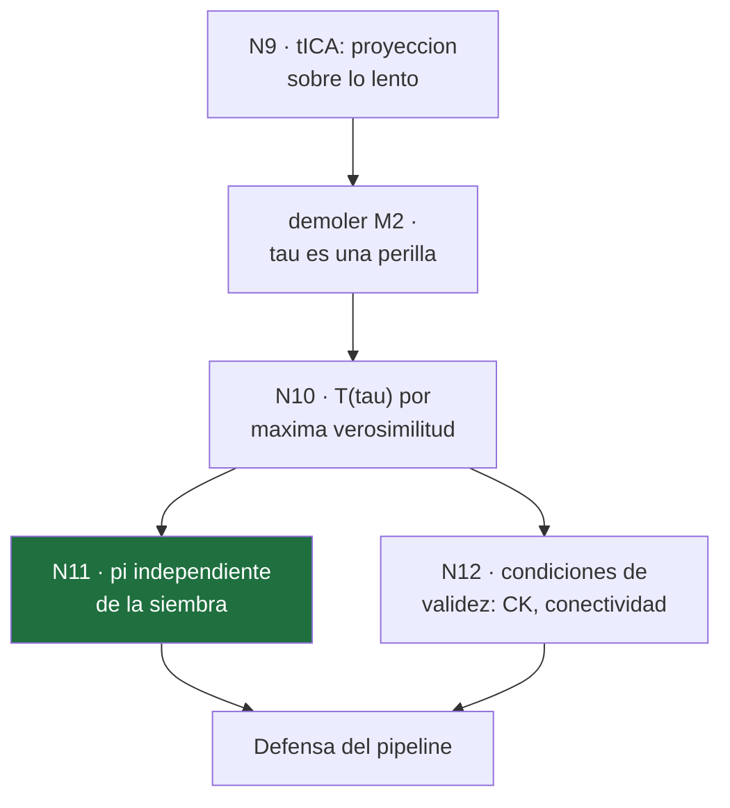

# 14 · Clase 5 — El Markov State Model

← [[00 MOC — Seminario VNAR]] · anterior: [[13 Clase 4 — tICA]]

**Nodos:** demoler **M2** → `N10` (qué estima un MSM) → `N11` (π independiente de la siembra — **el nodo central**) → `N12` (condiciones de validez).

> [!important] Dato del sondeo que abre esta clase
> Cuando te pregunté qué era el *lag time* $\tau$, elegiste **«el tiempo medio que el sistema permanece en un estado»**. Eso no es un despiste — es tratar $\tau$ como algo que el sistema **tiene**, en vez de un **parámetro que tú eliges**. Si $\tau$ fuera físico, no habría nada que validar: ni test de Chapman-Kolmogorov, ni barrido de lag. Esta clase empieza demoliendo exactamente eso.

---

## 1 · Demoler M2 — $\tau$ es una perilla, no una propiedad

### Motivación

Tienes trayectorias con etiquetas de microestado (Clase 4: 100 microestados, k-means sobre tICA). Para construir un modelo hace falta elegir **a qué distancia temporal** vas a mirar transiciones — ese es $\tau$. La pregunta socrática: **¿por qué no simplemente $\tau\to 0$, el máximo detalle posible?**

### Establecer — el argumento del mezclado

Un microestado es una **región** del espacio conformacional, no un punto. Dentro de esa región hay estructura: si acabas de **entrar** a un microestado viniendo de un vecino particular, todavía estás cerca del borde por el que entraste — y desde ahí, la probabilidad de волver a salir por el mismo borde (recruzar) es distinta de la probabilidad de un punto que lleva un rato **mezclándose** dentro del microestado.

> [!important] Esto ya lo viste — es el mismo argumento de la Clase 1 §3
> Recuerda el régimen $\tau_{\text{loc}} \ll T \ll \tau_{\text{esc}}$ que hacía que la MD sembrada muestreara bien la *forma* de cada cuenca. Aquí aparece la misma idea, aplicada a **microestados** en vez de macroestados: hace falta esperar más que $\tau_{\text{mix}}$ (el tiempo de mezclado *dentro* de un microestado) para que "estar en el estado $i$" sea toda la información relevante — sin importar por dónde entraste.

Formalizando: sea $\tau_{\text{mix}}$ el tiempo para que la distribución condicional *dentro* de un microestado olvide el punto de entrada. La propiedad de Markov —que el futuro solo dependa del microestado actual, no de la historia— es una **aproximación**, válida solo si:

$$
\tau \;\gtrsim\; \tau_{\text{mix}}
$$

Pero $\tau$ tampoco puede crecer sin límite: cada trayectoria de 100 ns solo da $100\,\text{ns}/\tau$ ventanas de conteo, y **menos ventanas = peor estadística**. Es un compromiso, no una constante de la naturaleza.

### Conectar — la ecuación de Chapman-Kolmogorov (derivada, no asumida)

Si el proceso **es** markoviano al lag $\tau$, hay una consecuencia matemática **necesaria** — no una suposición extra. Por la ley de probabilidad total, marginalizando sobre el estado intermedio en $t+\tau$:

$$
P(k \text{ en } t+2\tau \mid i \text{ en } t) = \sum_j P(k \text{ en } t+2\tau \mid j \text{ en } t+\tau)\; P(j \text{ en } t+\tau \mid i \text{ en } t)
$$

Y por la propiedad de Markov, cada factor es simplemente una entrada de $T(\tau)$:

$$
[T(2\tau)]_{ik} = \sum_j T(\tau)_{ij}\, T(\tau)_{jk} = [T(\tau)^2]_{ik}
$$

$$
\boxed{T(2\tau) = T(\tau)^2}
$$

> [!success] Esto es lo que se comprueba, no lo que se supone
> Si estimas $T(\tau)$ y $T(2\tau)$ **de forma independiente** a partir de los datos (contando transiciones a esos dos lags por separado) y **no coinciden** con $T(\tau)^2$, la dinámica **no es markoviana** a ese $\tau$ — hay memoria residual, señal de que $\tau < \tau_{\text{mix}}$. Ésa es la prueba de Chapman-Kolmogorov, y es la razón formal de que $\tau$ necesite validación en vez de asumirse.

---

> [!question] **Q1 · demolición de M2** — ¿Por qué la ecuación $T(2\tau)=T(\tau)^2$ sirve como test de si $\tau$ fue bien elegido?
>
> **a)** Porque es una consecuencia necesaria de la propiedad de Markov; si falla al comprobarla con datos, la dinámica tiene memoria a ese $\tau$
> **b)** Porque toda matriz de transición cumple esa igualdad por definición, así que comprobarla verifica que los datos se cargaron bien
> **c)** Porque $T(2\tau)$ siempre converge más rápido que $T(\tau)^2$, y comparar ambas cuantifica esa diferencia de velocidad
> **d)** Porque $\tau$ debe ser exactamente la mitad de la longitud de la trayectoria para que la igualdad tenga sentido

> [!success]- Respuesta Q1 → **a) Consecuencia necesaria de Markov** ✓
> $T(2\tau)=T(\tau)^2$ sale de ley de probabilidad total **más** la propiedad de Markov — es una **predicción**, no una identidad automática. Se estiman $T(\tau)$ y $T(2\tau)$ de forma **independiente** (conteos distintos de la misma trayectoria); si no coinciden, hay memoria residual y $\tau$ es demasiado corto.
> **M2 demolida:** $\tau$ no es una propiedad del sistema — es una elección que se valida con esta ecuación, no se asume.

---

## 2 · `N10` — Qué estima un MSM, exactamente

### Motivación

Ya tienes microestados (Clase 4) y un $\tau$ candidato validable (§1). Falta el paso central: convertir "en qué microestado estaba el sistema en cada frame" en un **modelo**. ¿Cómo, exactamente?

### Establecer — contar, y por qué contar es lo correcto

**Paso 1 — la matriz de conteos.** Recorre cada trayectoria y anota, para cada par de tiempos separados por $\tau$, en qué microestado estaba al principio y al final:

$$
C_{ij}(\tau) \;=\; \#\{\,t : s(t)=i,\ s(t+\tau)=j\,\}
$$

sumado sobre **todas** las trayectorias sembradas.

**Paso 2 — ¿por qué normalizar filas es lo correcto, y no otra cosa?** Esto se puede *derivar*, no solo declarar. Bajo la hipótesis de Markov, la probabilidad de observar exactamente la secuencia de transiciones contada es (cada transición $i\to j$ observada contribuye un factor $T_{ij}$, y hay $C_{ij}$ de esas):

$$
\mathcal{L}(T) = \prod_{i,j} T_{ij}^{\,C_{ij}}
$$

Tomando logaritmo (crece igual, más fácil de maximizar):

$$
\ln\mathcal{L}(T) = \sum_i\sum_j C_{ij}\ln T_{ij}
$$

**Paso 3 — maximizar con la restricción correcta.** $T$ no es una matriz cualquiera: cada fila es una distribución de probabilidad, $\sum_j T_{ij}=1$. Es un problema de **optimización con restricciones** — un multiplicador de Lagrange $\mu_i$ por cada fila:

$$
\widetilde{\mathcal{L}} = \sum_i\sum_j C_{ij}\ln T_{ij} \;-\; \sum_i \mu_i\Big(\sum_j T_{ij}-1\Big)
$$

Deriva respecto a una entrada $T_{ij}$ cualquiera e iguala a cero:

$$
\frac{\partial\widetilde{\mathcal{L}}}{\partial T_{ij}} = \frac{C_{ij}}{T_{ij}} - \mu_i = 0 \;\;\Longrightarrow\;\; T_{ij} = \frac{C_{ij}}{\mu_i}
$$

**Paso 4 — usa la restricción para encontrar $\mu_i$.** Suma sobre $j$ y usa $\sum_j T_{ij}=1$:

$$
1 = \sum_j T_{ij} = \frac{1}{\mu_i}\sum_j C_{ij} \;\;\Longrightarrow\;\; \mu_i = \sum_j C_{ij} \equiv C_i \;\;(\text{suma de la fila } i)
$$

$$
\boxed{\;T_{ij}(\tau) = \frac{C_{ij}(\tau)}{\sum_k C_{ik}(\tau)}\;}
$$

> [!success] No es una receta — es *la* solución
> Contar transiciones y normalizar por fila **no es un atajo razonable**: es literalmente el estimador de **máxima verosimilitud** bajo la hipótesis de Markov. Cualquier otra forma de construir $T$ le daría menos probabilidad a los datos observados.

### Conectar

Todo lo que quieras extraer del sistema —poblaciones, tiempos, macroestados— sale de este único objeto $T(\tau)$ por álgebra lineal. Nada más entra.

> [!warning] Un matiz técnico, con eco de la Clase 4
> Este estimador **no** garantiza reversibilidad ($\pi_iT_{ij}=\pi_jT_{ji}$, balance detallado). PyEMMA por defecto usa un estimador **reversible** —una versión con restricción extra— porque los sistemas físicos en equilibrio la cumplen, y **garantiza autovalores reales**. Es el mismo papel que jugaba simetrizar $C(\tau)$ en tICA (Clase 4 §2.4 bis): la reversibilidad es lo que domestica el espectro.

---

> [!question] **Q2 · N10** — En la derivación de $T_{ij}=C_{ij}/\sum_k C_{ik}$, ¿qué papel juega exactamente el multiplicador de Lagrange $\mu_i$?
>
> **a)** Es el valor necesario para que la fila $i$ de $T$ sume exactamente 1, y resulta ser la suma de conteos de esa fila
> **b)** Es un parámetro libre que se ajusta a mano para mejorar el ajuste del modelo
> **c)** Es el número de microestados total, fijo para todas las filas
> **d)** Es una corrección estadística para el ruido de muestreo, distinta de la restricción de normalización

---

## 3 · `N11` — El nodo que legitima todo el pipeline

### Motivación

Vuelve a la pregunta que quedó abierta desde la Clase 1: si sembraste con pesos $w_i\ne\pi_i$, un **histograma** de frames te da $\hat F(s)=F(s)-RT\ln(w_i/\pi_i)$ — sesgado, y el sesgo **no decrece** con más muestreo. El MSM promete arreglar esto. ¿Por qué habría de ser distinto?

### Establecer — el argumento de no-sesgo

**Paso 1 — qué es realmente $T_{ij}$.** Existe una probabilidad de transición **verdadera**, $\theta_{ij}$: la fracción de las veces que, *estando en el microestado $i$*, el sistema termina en $j$ tras un tiempo $\tau$. Es una propiedad de la **dinámica local** — no depende de cuántas veces visitaste $i$ en tu simulación, igual que la probabilidad de que salga cara en una moneda no depende de cuántas veces la lances.

**Paso 2 — qué mide realmente tu estimador.** Cada vez que el sistema está en $i$, la siguiente transición es, esencialmente, un lanzamiento con probabilidades $\theta_{i1},\theta_{i2},\dots$ (Markov). Si observaste $C_i=\sum_jC_{ij}$ visitas a $i$, el vector de conteos $(C_{i1},\dots,C_{iM})$ sigue una distribución **multinomial** con parámetros $(C_i;\theta_{i1},\dots,\theta_{iM})$.

**Paso 3 — el valor esperado del estimador, no depende de $C_i$.** Por las propiedades de la multinomial, $\mathbb{E}[C_{ij}] = C_i\,\theta_{ij}$. Sustituyendo en el estimador MLE del §2:

$$
\mathbb{E}\big[T_{ij}\big] = \mathbb{E}\left[\frac{C_{ij}}{C_i}\right] = \frac{C_i\,\theta_{ij}}{C_i} = \theta_{ij}
$$

$$
\boxed{\;\mathbb{E}[T_{ij}] = \theta_{ij}, \quad \text{para \emph{cualquier} } C_i > 0\;}
$$

**Y lo que sí depende de $C_i$ es la varianza** (de una proporción muestral, fórmula estándar):

$$
\mathrm{Var}(T_{ij}) \approx \frac{\theta_{ij}(1-\theta_{ij})}{C_i}
$$

> [!success] Ahí está la respuesta completa
> **Sembrar más en una región reduce la varianza de esa fila de $T$ — no desplaza su valor esperado.** Con $C_i$ pequeño, $T_{ij}$ es un estimador ruidoso de $\theta_{ij}$, pero sigue apuntando, en promedio, al valor correcto. Compara con el histograma de la Clase 1: ahí el sesgo era **sistemático** —no desaparecía con más datos—; aquí, con más datos, el estimador se **afina**, no se corrige un sesgo que nunca existió en primer lugar.

### Conectar — de $\theta$ (local, no sesgada) a $\pi$ (global)

$\pi$ se calcula **a partir de** la matriz $T$ completa — no a partir de cuántos frames hay en cada estado. Formalmente, para una matriz $T$ estocástica (filas suman 1), irreducible (todo estado alcanza a todo estado) y aperiódica, el teorema de **Perron–Frobenius** garantiza:

1. Existe una **única** distribución $\pi$ con $\pi^\top T=\pi^\top$, y su autovalor ($=1$) es el **más grande** de todos.
2. Para **cualquier** distribución inicial $p_0$, iterar $p_0^\top T^n \to \pi^\top$ cuando $n\to\infty$.

El punto (2) es la traducción formal de "$\pi$ no depende de dónde empezaste" — ni de dónde sembraste.

### Compruébalo tú mismo — un ejemplo de 2 estados

$$
T = \begin{pmatrix}0.9 & 0.1\\ 0.3 & 0.7\end{pmatrix}
$$

**Resolver $\pi$:** de $\pi^\top T=\pi^\top$, la primera componente da $0.9\pi_1+0.3\pi_2=\pi_1 \Rightarrow 0.3\pi_2=0.1\pi_1 \Rightarrow \pi_2=\pi_1/3$. Con $\pi_1+\pi_2=1$: $\pi_1(1+\tfrac13)=1\Rightarrow \pi_1=0.75,\ \pi_2=0.25$.

**Iterar desde dos siembras distintas** — "toda la siembra en el estado 1" ($p_0=(1,0)$) vs. "toda en el estado 2" ($p_0=(0,1)$):

| $n$ | desde $(1,0)$ | desde $(0,1)$ |
|---|---|---|
| 0 | $(1.00,\,0.00)$ | $(0.00,\,1.00)$ |
| 1 | $(0.90,\,0.10)$ | $(0.30,\,0.70)$ |
| 2 | $(0.84,\,0.16)$ | $(0.48,\,0.52)$ |
| 3 | $(0.804,\,0.196)$ | $(0.576,\,0.424)$ |
| $\vdots$ | $\to(0.75,\,0.25)$ | $\to(0.75,\,0.25)$ |

*(Verifícalo tú: $p_1 = p_0 T$ es multiplicar el vector fila por la matriz. Con $p_0=(1,0)$: $p_1=(1\cdot0.9+0\cdot0.3,\ 1\cdot0.1+0\cdot0.7)=(0.9,0.1)$.)*

> [!danger] Las dos siembras, radicalmente distintas, convergen al mismo sitio
> Empezar 100% en el estado 1 o 100% en el estado 2 da, después de suficientes pasos, **exactamente la misma** $\pi=(0.75,0.25)$. Eso es lo que significa, en números pequeños y verificables, que "$\pi$ no depende de dónde sembraste".

---

> [!question] **Q3 · N11** — Sembraste el 90 % de tus trayectorias en la cuenca $A$ y el 10 % en la cuenca $B$. La $\pi$ verdadera es $(0.3, 0.7)$. Con suficientes transiciones observadas en cada cuenca para estimar bien sus filas de $T$, ¿qué $\pi$ obtienes del MSM?
>
> **a)** $\approx(0.3,\,0.7)$ — la verdadera, porque $\pi$ sale de $T$, no de cuánto sembraste
> **b)** $\approx(0.9,\,0.1)$ — reflejando las proporciones de siembra
> **c)** $\approx(0.6,\,0.4)$ — un punto intermedio entre la siembra y la verdad
> **d)** Indeterminado: no hay forma de saber $\pi$ sin conocer los pesos de siembra

> [!success]- Respuesta Q3 → **a) $\approx(0.3,\,0.7)$, la verdadera** ✓
> La proporción de siembra **no aparece** en el resultado. Cada fila de $T$ estima la dinámica **local**, no sesgada por cuántas visitas hubo (§3, Paso 3); $\pi$ se calcula del $T$ completo por álgebra lineal, y hereda ese valor correcto.
> **Contraste exacto con la Clase 1:** el histograma pesa cada *frame* por igual, así que la proporción de frames por cuenca **es** la proporción de siembra — de ahí el sesgo sistemático. El MSM cuenta **transiciones** para estimar **tasas locales**, un objeto estadístico distinto construido sobre los mismos datos crudos.

---

## 4 · `N12` — Las condiciones de validez, la letra pequeña

### Motivación

En la Q3 puse a propósito la condición *"con suficientes transiciones observadas en cada cuenca"*. Nada de lo anterior es gratis — hay tres condiciones concretas que hacen falta, y cada una es una forma de que el argumento de §3 se rompa.

### Las tres condiciones

**1 · Markovianidad al $\tau$ elegido** — ya la tienes: se valida con el test de Chapman–Kolmogorov (§1). Si falla, $T(\tau)$ ni siquiera estima $\theta$ correctamente — la propia noción de "tasa local" deja de tener sentido limpio.

**2 · Conectividad** — Perron–Frobenius exige que $T$ sea **irreducible**: todo estado debe poder alcanzar a todo estado (quizá con pasos intermedios). Si el grafo de transiciones tiene componentes desconectadas —zonas que la simulación nunca conectó con el resto— no hay una $\pi$ única para todo el sistema. La práctica estándar es restringirse al **conjunto conectado más grande** y reportar qué fracción de los microestados quedó fuera.

> [!danger] Y esto reconecta con la Clase 4
> Si el movimiento lento de HV2 nunca se sesgó ni se visitó (Clase 4 §4), los microestados que representarían ese movimiento **ni siquiera existen** en los datos — no es un problema de conectividad que un MSM más grande resuelva: es que esos nodos del grafo **nunca se crearon**.

**3 · Suficiente muestreo por fila** — de $\mathrm{Var}(T_{ij})\approx\theta_{ij}(1-\theta_{ij})/C_i$: si $C_i$ es muy pequeño, la fila $i$ de $T$ es **extremadamente ruidosa**, aunque siga centrada en el valor correcto en promedio. Con demasiado poco, la varianza sobre $\pi$ (que hereda el ruido de todas las filas) puede ser enorme — sin que eso se note a menos que **se calcule explícitamente**.

> [!warning] La pregunta que casi nadie hace en una lab meeting
> El paper no reporta si usó un estimador de máxima verosimilitud puro o un `BayesianMSM` (que sí da barras de error sobre $\pi$ y los tiempos, gratis en PyEMMA 2). El argumento de esta clase demuestra que $\pi$ **no está sesgada** por la siembra — pero no dice nada sobre **cuán ruidosa** es la estimación reportada. Una $\pi$ insesgada con una varianza enorme puede seguir siendo, en la práctica, poco informativa.

### Conectar — el resumen de todo el edificio

$$
\underbrace{T(\tau)}_{\text{MLE, }\S2} \;\xrightarrow{\text{si (1),(2),(3)}}\; \underbrace{\pi,\ t_i}_{\text{Perron–Frobenius, }\S3} \;\xrightarrow{\text{PCCA+}}\; \text{macroestados}
$$

Cada flecha es una **condición verificable**, no un acto de fe. Y cada una, si falla, es un ataque metodológico concreto — no una vaga sospecha.

---

> [!question] **Q4 · cierre de Clase 5** — De las tres condiciones (Markovianidad, conectividad, muestreo suficiente), ¿cuál es la que hace que el argumento de N11 sea insensible *en promedio* a la siembra, pero **no** garantiza que la estimación sea *precisa*?
>
> **a)** Suficiente muestreo por fila — su ausencia no sesga $\pi$, pero infla su varianza sin avisar
> **b)** Markovianidad — su ausencia hace que $\pi$ se sesgue directamente hacia la siembra
> **c)** Conectividad — su ausencia hace que $\pi$ favorezca las cuencas más sembradas
> **d)** Las tres garantizan tanto ausencia de sesgo como precisión por igual
