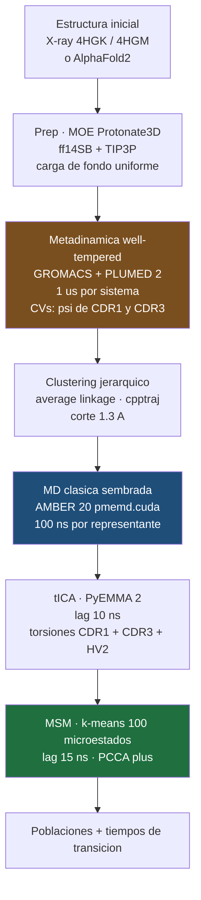

# 20 · Paper — parámetros exactos

← [[00 MOC — Seminario VNAR]]

Extraído de `../fimmu-13-953917.pdf` (secciones *Methods*, *Metadynamics simulations*, *Molecular dynamics simulations*, Tabla 1). Todo lo de esta nota está **en el paper**; lo que es inferencia mía va marcado.

---

## El pipeline

---

## Tabla maestra de parámetros

| Etapa | Parámetro | Valor |
|---|---|---|
| **Estructuras** | X-ray | `4HGK` (E06 + HSA), `4HGM` (huE06 v1.1 + HSA) |
| | Modelos | **AlphaFold2** para v1.2, v1.4, v1.10, DPK9 |
| | Protonación | MOE 2020.09, **Protonate3D** |
| | Topología | `tleap`, AmberTools20 |
| **Sistema** | Campo de fuerza | AMBER **ff14SB** |
| | Agua | **TIP3P**, caja cúbica, pared mínima 10 Å |
| | Neutralización | **carga de fondo uniforme** — *no* contraiones explícitos |
| | Equilibrado | protocolo multietapa (ref. 64, Wallnoefer/Liedl 2011) |
| **Metadinámica** | Variante | **well-tempered** |
| | Motor | GROMACS + **PLUMED 2** |
| | **CVs** | combinación lineal de $\sin$ y $\cos$ de las torsiones $\boldsymbol\psi$ de **CDR1 y CDR3** |
| | Implementación CV | `MATHEVAL` + `COMBINE` |
| | Altura gaussiana | **10.0 kJ/mol** |
| | Ancho gaussiano | **0.3 rad** |
| | Deposición | cada **1000 pasos** |
| | **Biasfactor** $\gamma$ | **10** |
| | Duración | **1 µs** por sistema (apo); **+1 µs holo** solo para E06 y v1.1 |
| | Termostato | velocity rescaling (Bussi) |
| | Barostato | Parrinello–Rahman, NpT, 300 K |
| **Clustering** | Algoritmo | **average linkage** jerárquico, `cpptraj` |
| | Métrica de corte | distancia **1.3 Å** |
| | Resultado | *"a large number of clusters"* — nº exacto **no publicado** |
| **MD sembrada** | Motor | AMBER 20, `pmemd.cuda` |
| | Duración | **100 ns** por representante de cluster |
| | Restricciones | **SHAKE**, paso de **2 fs** |
| | Termostato | **Langevin**, 300 K |
| | Barostato | **Berendsen** (weak coupling), NpT |
| **tICA** | Features | torsiones de backbone de **CDR1, CDR3, HV2** |
| | Lag | **10 ns** |
| | Software | PyEMMA 2 |
| **MSM** | Microestados | **100**, k-means |
| | Lag | **15 ns** |
| | Coarse-graining | **PCCA+** (clustering espectral sobre autovectores de $T$) |
| | Validación | test de **Chapman–Kolmogorov**, **VAMP**, fracción de estados conectados |
| | Estimador | ⚠️ **no especificado** (¿ML o bayesiano?) → [[99 Pendientes de verificación]] |
| **Análisis** | Entropías dihedrales | `X-entropy` — KDE gaussiano, bandwidth *plug-in*, C++/OpenMP |
| | Contactos | `GetContacts` + scripts propios → [github.com/liedllab/GetContacts_analysis](https://github.com/liedllab/GetContacts_analysis) |
| | Visualización | PyMOL |

> [!note] Discrepancia entre etapas — la base de [[22 Superficie de ataque#🔴 A2 — HV2 entra en el MSM pero nunca se sesgó en la metadinámica|A2]]
> Las **CVs de metadinámica** cubren `CDR1` + `CDR3`.
> Los **features de tICA/MSM** cubren `CDR1` + `CDR3` + **`HV2`**.
> HV2 nunca recibió sesgo, pero entra en el modelo cinético **y sostiene la conclusión biológica**.

---

## Tabla 1 del paper + reconstrucción de semillas

| Variante | Estructura inicial | Tiempo agregado / µs | Semillas implícitas\* |
|---|---|---|---|
| **E06** (parent) | X-ray `4HGK` | **11.9** ← mínimo | ~99 |
| huE06 v1.1 | X-ray `4HGM` | 28.2 | ~262 |
| huE06 v1.2 | AlphaFold2 | 17.4 | ~164 |
| **huE06 v1.4** | AlphaFold2 | **43.1** ← máximo | ~421 |
| huE06 v1.10 | AlphaFold2 | 20.0 | ~190 |
| DPK9 (Vκ1) | AlphaFold2 | 33.8 | ~328 |

> [!warning] \*Reconstrucción propia — no está en el paper
> La Tabla 1 solo publica **tiempo agregado**; el número de clusters no aparece pese a que el texto remite a la tabla ("*resulting in a large number of clusters (Table 1)*").
> Mi aritmética: $(\text{tiempo agregado} - \text{metaD}) / 100\ \text{ns}$, restando 2 µs de metaD para E06 y v1.1 (apo + holo) y 1 µs para el resto. **Depende de asumir que el tiempo agregado incluye la metadinámica** — el paper no lo aclara.
> El **ratio sobrevive** a esa ambigüedad, y es lo único que necesito para [[22 Superficie de ataque#🔴 A1 — El muestreo está confundido con el observable|A1]]: **v1.4 recibió ≈3.6× el muestreo de E06.**

---

## Resultados numéricos clave

| Cantidad | Valor |
|---|---|
| Población del estado competente, **E06** | **92 %** |
| Población del estado competente, **huE06 v1.1** | **16 %** |
| Población del estado competente, **huE06 v1.4** | **16 %** |
| $\Delta\Delta G$ equivalente (E06 → v1.1) | **≈ 10 kJ/mol** ≈ 2.4 kcal/mol *(cálculo mío, ver [[10 Clase 1 — El problema y el pivote#Nodo R2 · Población de equilibrio = peso de Boltzmann\|Clase 1 Q2]])* |
| Barra de error sobre esas poblaciones | **ninguna reportada** |

### Qué muestra cada figura

| Figura | Contenido | Ojo con |
|---|---|---|
| **1** | Esquema de IgNAR y estructura de E06 ± HSA | — |
| **2** | Alineamiento de secuencias + hidrofobicidad de superficie (escala Wimley–White) | — |
| **3A** | "Free energy surfaces" de CDR1, CDR3 y paratopo, proyectadas en tICs | ⚠️ **¿reponderadas por el MSM o histograma crudo?** → [[22 Superficie de ataque#🟠 A6 — ¿Las "superficies de energía libre" de la Fig. 3A están reponderadas?\|A6]] |
| **3B** | Histogramas de contactos intradominio por frame | sensible al muestreo |
| **3C** | Entropías dihedrales por residuo, proyectadas en la estructura | ⚠️ KDE crece con nº de muestras → [[22 Superficie de ataque#🔴 A1 — El muestreo está confundido con el observable\|A1]] |
| **4A–D** | Paisajes del MSM: poblaciones de macroestados + tiempos de transición | lenguaje de MSM ("state probabilities"), sin barras de error |
| **5** | Fingerprints y flareplots de contactos antibody–antigen | base del claim sobre HV2 |

---

## Detalles fáciles de pasar por alto

- **El clustering es sobre las trayectorias de metadinámica**, es decir sobre configuraciones generadas **bajo sesgo**. Las semillas no son confórmeros de equilibrio.
- **La metadinámica holo solo existe para E06 y v1.1**, porque solo esas dos tienen cristal con antígeno. Los demás sistemas nunca se simularon con antígeno → la comparación holo es de 2 sistemas, no de 6.
- **Termostatos distintos por etapa:** velocity rescaling (Bussi) en la metadinámica de GROMACS, Langevin en la MD de AMBER. Cambian motor, termostato **y** barostato entre etapas.
- **Barostato Berendsen** en la etapa de producción: no genera el ensemble NpT correcto (no tiene las fluctuaciones de volumen adecuadas). Impacto pequeño en observables conformacionales, pero es un punto técnico legítimo.
- **`SHAKE` citado como Miyamoto & Kollman 1992**, que en realidad es **SETTLE** → [[22 Superficie de ataque#🟡 A9 — Higiene de citas|A9]].
- El motivo revertido en v1.10 es **`RKN`** — dos residuos básicos (Arg, Lys), relevante para [[22 Superficie de ataque#🟡 A8 — Carga de fondo uniforme en lugar de contraiones|A8]].
